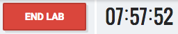

# Welcome to Container-Native Storage Hands-on Lab

This lab guide is designed for self-paced walk-through of the "Container-Native Storage 3.6 on OpenShift 3.7" hosted on [redhat.qwkilab.com](https://redhat.qwiklab.com). This lab gives you access to a fully functional OpenShift Container Platform 3.7 environment hosted on AWS.
This is not a tutorial on OpenShift Container Platform. Basic familiarity is assumed.
Completing the entire lab content will typically take between 2 and 4 hours.

## 1. Pre-requisites

For this lab you need to fulfil the following pre-requisites:

- Workstation with Internet access

- SSH client supporting authentication with a private key

## 2. How to start your Test Drive

To start the Test Drive press  button in the top bar.

In total you can start the lab **5** times. Then your quota of free lab environments has reached it's limit. Contact us if you want to run even more labs.

## 3. Download Access Key

Immediately after pressing the  button, the download links for the SSH keys will become active (blue) in the left hand pane in a section labeled "Connection Details":

Download the *PEM* key to your computer if you are using regular OpenSSH on the command line with Linux or macOS. Choose *Download PPK* if you are using PuTTY on Windows.

## 4. Wait for lab provisioning to complete

When you started your Test Drive the lab environment provision process initiated in the background. During provisioning you can monitor progress in the top bar above this guide:

In total provisioning usually takes about 5 minutes and should not exceed 10 minutes.
When your lab infrastructure is ready this progress bar disappears. Upon launch you will see a button to end your lab session and a countdown until automatic shutdown:

## 4. Get the lab access credentials

When lab provisioning is finished successfully lab access data will displayed on the left side of this screen.

|Type | Name | Example Value |
|------------| -------- |-------- |
|URL to OpenShift UI| OpenShiftLoginURL |e.g. *https://34.226.81.9.nip.io:8443/* |
|IP to Lab Environment | MasterNodePublicIP |e.g. *34.226.81.9* |
|SSH user on master node | SSHLoginUser | `ec2-user` |

&#8680; To login via SSH download the PEM file to your machine and change the permissions:

    chmod 0400 ~/Downloads/<pem-file-name>

&#8680; Then login with the ssh client like this:

    ssh -i ~/Downloads/<pem-file-name> -l ec2-user <MasterNodePublicIP>

The Master node also functions as your *jumpserver*. Once you are logged on to it you have access to all systems with the `ec2-user` who has passwordless authentication and passwordless sudo capabilities set up everywhere.

---

## 6. Lab Environment Overview

The lab environment has 10 nodes in total with stable, internal IP addresses and `/etc/hosts`-based DNS resolution. All nodes have internet access. Only the Master can be reached from the Internet via it's public IP however.

|Host | Interal FQDN | Internal IP address |
|------------| -------- |-------- |
|OpenShift Master| master.lab | 10.0.1.100 |
|OpenShift Infra Node 1| infra-1.lab | 10.0.2.101 |
|OpenShift Infra Node 2| infra-2.lab | 10.0.3.102 |
|OpenShift Infra Node 3| infra-3.lab | 10.0.4.103 |
|OpenShift App Node 1| node-1.lab | 10.0.2.201 |
|OpenShift App Node 2| node-2.lab | 10.0.3.202 |
|OpenShift App Node 3| node-3.lab | 10.0.4.203 |
|OpenShift App Node 4| node-4.lab | 10.0.4.204 |
|OpenShift App Node 5| node-5.lab | 10.0.3.205 |
|OpenShift App Node 6| node-6.lab | 10.0.4.206 |

You don't need to remember this - this is purely informational.
This labs topology roughly looks like this:

---

## 7. Lab tips

You might these hints useful:

- almost all of the commands/files don't contain environment-specific content, there is a <kbd>copy-to-clipboard</kbd> button on the right end of every code block for your convenience
- this lab uses nip.io for DNS resolution of the public IP specific to your lab, keep that in mind when working with URLs in the lab
- you can skip modules in this lab, unless stated otherwise in the *Overview* section they are independent of each other
- if you want to look at this lab guide in a separate window: this documentation is hosted at <a href="https://dmesser.github.io/ocp-3.7-cns-3.6-lab/" target="_blank">https://dmesser.github.io/ocp-3.7-cns-3.6-lab</a>

Have fun!
