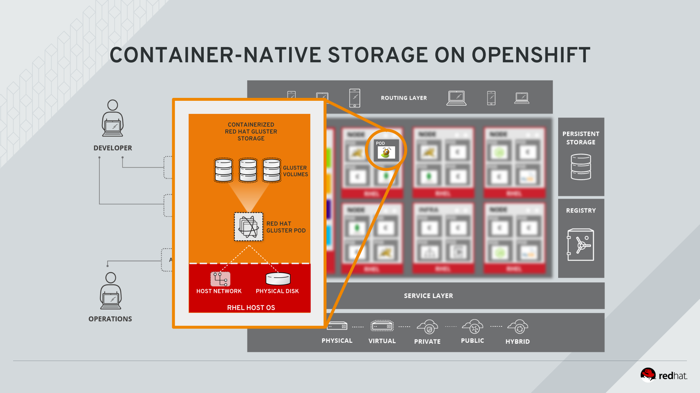
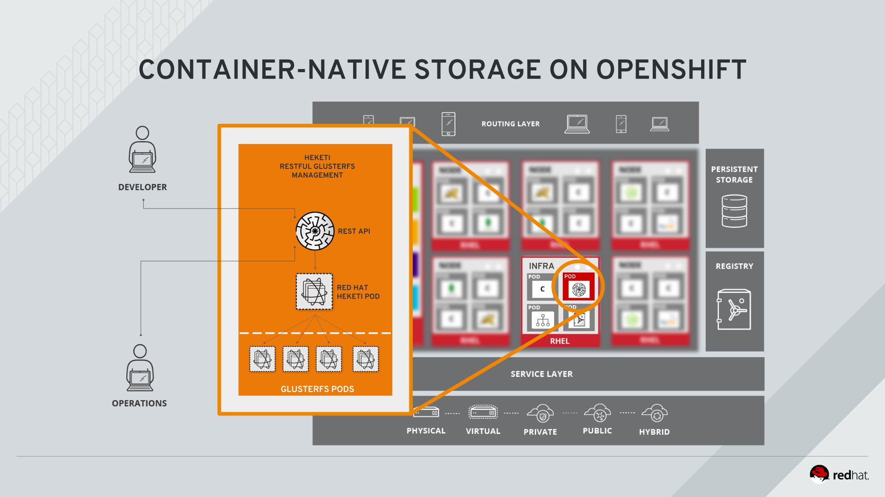

!!! Summary "Overview"
    In this module you will set up Container-Native Storage (CNS) in your OpenShift environment. You will use this in later modules to dynamically provision storage to be available to workloads in OpenShift.
    CNS is GlusterFS running in containers, orchestrated by OpenShift via a REST API. GlusterFS in turn is backed by local storage available to the OpenShift nodes.
    This module has no pre-requisites.

All of the following tasks are carried out as the `ec2-user` from the master node. For copy&paste convenience we will omit the shell prompt unless necessary.

&#8680; Make sure you are logged on as the `ec2-user` to the master node:

    hostname -f

As the output indicates, you should be on the master node:

    master.lab

&#8680; First ensure you have the correct openshift-ansible version installed on the system.

    yum list installed openshift-ansible

A version higher than or equals to `3.6.173.0.5-3` is required to utilize the **OpenShift Advanced Installer** to deploy CNS.

~~~~
Installed Packages
openshift-ansible.noarch                   3.6.173.0.21-2.git.0.44a4038.el7                    @rhel-7-server-ose-3.6-rpms
~~~~

---

Review the Ansible Inventory Configuration
------------------------------------------

!!! Hint
    As of OpenShift Container Platform 3.6 it's possible to deploy CNS using `openshift-ansible` - the *advanced installation method* of OpenShift. The method of using the `cns-deploy` utility to install CNS components in an existing OpenShift cluster remains available but is not covered in this lab.

Installing CNS with `openshift-ansible` means all configuration options for CNS are now managed in the Ansible inventory, a text file by which the installer determines what should be installed and where.

An inventory file with the correct settings for CNS has been provided for you in `/etc/ansible/ocp-with-glusterfs`

<kbd>/etc/ansible/ocp-with-glusterfs:</kbd>
~~~~ini hl_lines="4 22 23 24 25 26 50 51 52 53"
[OSEv3:children]
masters
nodes
glusterfs

[OSEv3:vars]
deployment_type=openshift-enterprise
containerized=true
openshift_image_tag=v3.6.173.0.21
openshift_master_identity_providers=[{'name': 'htpasswd', 'login': 'true', 'challenge': 'true', 'kind': 'HTPasswdPasswordIdentityProvider', 'filename': '/etc/origin/master/htpasswd'}]
openshift_master_htpasswd_users={'developer': '$apr1$bKWroIXS$/xjq07zVg9XtH6/VKuh6r/','operator': '$apr1$bKWroIXS$/xjq07zVg9XtH6/VKuh6r/'}
openshift_master_default_subdomain='cloudapps.35.158.172.55.nip.io'
openshift_router_selector='role=master'
openshift_registry_selector='role=infra'
openshift_metrics_install_metrics=false
openshift_metrics_hawkular_hostname="hawkular-metrics.{{ openshift_master_default_subdomain }}"
openshift_metrics_cassandra_storage_type=pv
openshift_metrics_cassandra_pvc_size=10Gi
openshift_hosted_logging_deploy=false
openshift_logging_es_pvc_size=10Gi
openshift_logging_es_pvc_dynamic=true
openshift_storage_glusterfs_namespace=app-storage
openshift_storage_glusterfs_image=rhgs3/rhgs-server-rhel7
openshift_storage_glusterfs_version=3.2.0-7
openshift_storage_glusterfs_heketi_image=rhgs3/rhgs-volmanager-rhel7
openshift_storage_glusterfs_heketi_version=3.2.0-11
openshift_docker_additional_registries=mirror.lab:5555
openshift_docker_insecure_registries=mirror.lab:5555
oreg_url=http://mirror.lab:5555/openshift3/ose-${component}:${version}
openshift_examples_modify_imagestreams=true
openshift_disable_check=disk_availability,memory_availability

[masters]
master.lab openshift_public_hostname=35.158.172.55.nip.io openshift_hostname=master.lab openshift_ip=10.0.1.100 openshift_public_ip=35.158.172.55

[masters:vars]
openshift_schedulable=true
openshift_node_labels="{'role': 'master'}"

[nodes]
master.lab openshift_public_hostname=35.158.172.55.nip.io openshift_hostname=master.lab openshift_ip=10.0.1.100 openshift_public_ip=35.158.172.55
infra-1.lab openshift_hostname=infra-1.lab openshift_ip=10.0.2.101 openshift_node_labels="{'role': 'infra'}"
infra-2.lab openshift_hostname=infra-2.lab openshift_ip=10.0.3.102 openshift_node_labels="{'role': 'infra'}"
infra-3.lab openshift_hostname=infra-3.lab openshift_ip=10.0.4.103 openshift_node_labels="{'role': 'infra'}"
node-1.lab openshift_hostname=node-1.lab openshift_ip=10.0.2.201 openshift_node_labels="{'role': 'app'}"
node-2.lab openshift_hostname=node-2.lab openshift_ip=10.0.3.202 openshift_node_labels="{'role': 'app'}"
node-3.lab openshift_hostname=node-3.lab openshift_ip=10.0.4.203 openshift_node_labels="{'role': 'app'}"
node-4.lab openshift_hostname=node-4.lab openshift_ip=10.0.4.204 openshift_node_labels="{'role': 'app'}"

[glusterfs]
node-1.lab glusterfs_ip=10.0.2.201 glusterfs_zone=1 glusterfs_devices='[ "/dev/xvdc" ]'
node-2.lab glusterfs_ip=10.0.3.202 glusterfs_zone=2 glusterfs_devices='[ "/dev/xvdc" ]'
node-3.lab glusterfs_ip=10.0.4.203 glusterfs_zone=3 glusterfs_devices='[ "/dev/xvdc" ]'
~~~~

The highlighted lines show the settings relevant for CNS deployment. In summary what is provided is:

 - a hostgroup called `[glusterfs]` is created with all those OpenShift nodes that are designed to run CNS
 - *(optional)* a custom name for the namespace is provided in which the CNS pods will live
 - *(optional)* a specific name and version of the required container images to be used
 - information about available block devices, zone and *(optionally)* IP addresses for GlusterFS traffic for each host in the `[glusterfs]` group

In every environment the following pre-requisites need to be met:

- the designated nodes have a valid Red Hat Gluster Storage Subscription
- the device names in `glusterfs_devices` should contain no data or filesystem/LVM structures
- there need to be at least 3 nodes in the `[glusterfs]` host group and these should also be part of the `[nodes]` group

!!! Tip "What is the zone ID for?"

    A zone identifies a failure domain in GlusterFS. In CNS data is by default always replicated 3 times. Reflecting these failure domains by zone IDs as arbitrary but distinct numerical values allows CNS to ensure that two copies are never stored on nodes in the same failure domain.

    CNS will also work without zone definitions, but it's less smart. This information is considered when building new volumes, expanding existing volumes or replacing bricks in degraded volumes.
    An example for failure domains are AWS Availability Zones or physical servers sharing the same PDU.

    In this lab environment we have 3 different zones, because the nodes are residing in 3 distinct AWS Availability Zones.

---

Run the installer
-----------------

&#8680; First ensure that from an Ansible-perspective the required nodes are reachable:

    ansible -i /etc/ansible/ocp-with-glusterfs glusterfs -m ping

All 3 OpenShift application nodes should respond:

~~~~
node-3.lab | SUCCESS => {
    "changed": false,
    "ping": "pong"
}
node-1.lab | SUCCESS => {
    "changed": false,
    "ping": "pong"
}
node-2.lab | SUCCESS => {
    "changed": false,
    "ping": "pong"
}
~~~~

&#8680; Run the CNS installation playbook that ships as part of `openshift-ansible`:

    ansible-playbook -i /etc/ansible/ocp-with-glusterfs \
    /usr/share/ansible/openshift-ansible/playbooks/byo/openshift-glusterfs/config.yml

!!! Danger "Important":
    In this lab exercise you are directly invoking the CNS-related playbooks of `openshift-ansible`. This is **not supported** in production as of yet.
    The supported way to deploy CNS with `openshift-ansible` is to include the configuration in the inventory file from the very beginning and deploy it with OpenShift. Special care has been taken in this lab so that it works with an existint OCP deployment.

    Official support for post-deploy CNS installation with this method is planned for one of the next minor releases.

The installation will take approximately 4-5 minutes. In the meantime proceed with the next paragraph.

---

What happens in the background
------------------------------

CNS provides software-defined storage hosted on OpenShift used by OpenShift. In particular it's based on *Red Hat Gluster Storage* running in OpenShift pods with direct access the host's network and storage device.
Gluster effectively virtualizes the local storage capacity of each node into a flat namespace providing scale-out, federated file storage transparently as a single mount point across the network.

During the deployment you can either use the web console or the CLI tools to monitor what's created.

When logging to the Web UI as `operator`, selecting the project called **app-storage** and navigating to **Applications** > **Pods** it will look similar to this:

When done, going back to the **Overview** page it should look like this:

The pods named `glusterfs-...` are running GlusterFS in containers which have super-privileged access to the block device(s) and networking device (shares same IP address, reserves certain ports) of the container host:

At least 3, but potentially more, GlusterFS pods form a cluster (a *Trusted Storage Pool* in GlusterFS terminology) across which storage will transparently be replicated in a synchronous fashion.

After some time you will see a 4th pod come up. *heketi* is a component that will expose an API for GlusterFS to OpenShift. This allows OpenShift to dynamically allocate storage from CNS in a programmatic fashion. See below for a visualization. Note that for simplicity, in our lab environment heketi may be scheduled on one of the OpenShift App nodes. In production `heketi` should be configured to run on OpenShift Infrastructure nodes.

!!! Tip:
    For the extra curious - or if you still need to beat some time - here is a more detailed list of actions that are performed:

    - an OpenShift namespace is selected / created for the CNS pods
    - the permission to run CNS pods in `privileged` mode is added to the *ServiceAccount* used by CNS
    - a JSON structure is created that lays out a map of OpenShift nodes that will run CNS (called a `topology`), including information about their network and available disk devices
    - passwords are generated for user and administrative accounts of the CNS API server (`heketi`)
    - a set of templates are used to create an intermediary instance of *heketi*
    - the designated CNS nodes are labeled with a specific key-value pair
    - a `DaemonSet` configuration is created that causes a CNS pod to launch on every node matching that key-value pair
    - the intermediary instance of *heketi* uses the JSON-formatted topology to initialize the CNS pods (creating LVM and directory structures on the supplied block devices)
    - the intermediary instance of *heketi* is used to initiate GlusterFS peering so the CNS pods form a GlusterFS *Trusted Storage Pool*
    - the intermediary instance of *heketi* is used to create a GlusterFS volume to host the *heketi*-internal database (based on `BoltDB`)
    - a copy of the database of the intermediary *heketi* instance is created on that volume
    - the intermediary instance is terminated and a new *heketi* instance is deployed mounting the GlusterFS volume and the database
    - a `Service` is created in OpenShift to expose the API of *heketi* to the network
    - a `Route` is created in OpenShift to make the *heketi* pod reachable from the outside

---

By now the installation should have completed successfully with output similar to the below:

~~~~
PLAY RECAP ***************************************************************************************************************
infra-1.lab                : ok=72   changed=3    unreachable=0    failed=0
infra-2.lab                : ok=72   changed=3    unreachable=0    failed=0
infra-3.lab                : ok=72   changed=3    unreachable=0    failed=0
localhost                  : ok=9    changed=0    unreachable=0    failed=0
master.lab                 : ok=137  changed=34   unreachable=0    failed=0
node-1.lab                 : ok=86   changed=4    unreachable=0    failed=0
node-2.lab                 : ok=86   changed=4    unreachable=0    failed=0
node-3.lab                 : ok=86   changed=4    unreachable=0    failed=0
node-4.lab                 : ok=72   changed=3    unreachable=0    failed=0

Wednesday 20 September 2017  11:44:29 +0000 (0:00:00.157)       0:04:33.834 ***
===============================================================================
openshift_storage_glusterfs : Wait for GlusterFS pods ------------------ 83.80s
openshift_storage_glusterfs : Wait for deploy-heketi pod --------------- 31.64s
openshift_version : Get available atomic-openshift version ------------- 19.64s
openshift_storage_glusterfs : Wait for heketi pod ---------------------- 10.90s
openshift_storage_glusterfs : Wait for copy job to finish -------------- 10.88s
openshift_storage_glusterfs : Delete deploy resources ------------------- 5.20s
openshift_storage_glusterfs : Load heketi topology ---------------------- 4.81s
openshift_facts : Ensure various deps are installed --------------------- 4.57s
openshift_storage_glusterfs : Create heketi DB volume ------------------- 3.55s
openshift_version : Get available atomic-openshift version -------------- 3.17s
openshift_storage_glusterfs : Deploy deploy-heketi pod ------------------ 3.06s
openshift_storage_glusterfs : Deploy heketi pod ------------------------- 3.04s
openshift_storage_glusterfs : Label GlusterFS nodes --------------------- 2.14s
openshift_storage_glusterfs : Deploy GlusterFS pods --------------------- 1.75s
openshift_docker_facts : Set docker facts ------------------------------- 1.61s
openshift_storage_glusterfs : Add service accounts to privileged SCC ---- 1.44s
openshift_storage_glusterfs : Verify target namespace exists ------------ 1.43s
openshift_docker_facts : Set docker facts ------------------------------- 1.39s
openshift_facts : Gather Cluster facts and set is_containerized if needed --- 1.25s
openshift_storage_glusterfs : Create heketi service account ------------- 1.08s
~~~~

Notice there are 0 failed tasks on any host.

---

Test Container-native Storage
-----------------------------

At this stage you have deployed CNS. Let’s verify all components are in place.

&#8680; If not already there on the CLI on the Master node change back to the `app-storage` namespace:

    oc project app-storage

&#8680; First, verify that a new OpenShift `StorageClass` has been created:

    oc get storageclass

The `StorageClass` is used later in OpenShift request storage from CNS:

~~~~
NAME                TYPE
glusterfs-storage   kubernetes.io/glusterfs
~~~~

&#8680; Next, list all running pods:

    oc get pods -o wide

You should see all pods up and running. Highlighted below are pods that run GlusterFS containerized sharing the IP of the OpenShift node they are running on.

~~~~ hl_lines="2 3 4"
NAME                      READY     STATUS    RESTARTS   AGE       IP           NODE
glusterfs-storage-6p5zh   1/1       Running   0          57m       10.0.4.203   node-3.lab
glusterfs-storage-9mx29   1/1       Running   0          57m       10.0.3.202   node-2.lab
glusterfs-storage-ww7s2   1/1       Running   0          57m       10.0.2.201   node-1.lab
heketi-storage-1-h27cg    1/1       Running   0          55m       10.131.2.4   node-4.lab
~~~~

!!! Note
    The exact pod names will be different in your environment, since they are auto-generated. Also the *heketi* pod might run on another node with another IP.

To expose heketi’s API a `Service` named *heketi* has been generated in OpenShift.

&#8680; Check the `Service` with:

    oc get service/heketi-storage

The output should look similar to the below:

    NAME             CLUSTER-IP       EXTERNAL-IP   PORT(S)    AGE
    heketi-storage   172.30.225.240   <none>        8080/TCP   1h

To also use heketi outside of OpenShift in addition to the `Service` a `Route` has been deployed.

&#8680; Display the route with:

    oc get route/heketi-storage

The output should look similar to the below:

    NAME             HOST/PORT                                                   PATH      SERVICES         PORT      TERMINATION   WILDCARD
    heketi-storage   heketi-storage-app-storage.cloudapps.35.158.172.55.nip.io             heketi-storage   <all>                   None

Based on this *heketi* will be available on the heketi API URL, in this example:
http://*heketi-storage-app-storage.cloudapps.35.158.172.55.nip.io*

!!! Note:
    In your environment the URL will be slightly different. It will contain the public IPv4 address of your deployment, dynamically resolved by the nip.io service.

&#8680; You may verify this trivial health check using `curl` (and an in-line `oc` command to dynamically retrieve the `route` for easy copy&paste):

    curl http://$(oc get route/heketi-storage -o jsonpath='{.spec.host}')/hello

This should say:

    Hello from Heketi

This verifies heketi is running. To ensure it's functional and has been set up with authentication we are going to query it with the heketi CLI client.

First, the client needs to know the heketi API URL above and the password for the built-in `admin` user.

&#8680; View the generated `admin` password for *heketi* from the pod configuration using **YOUR specific pod name**, e.g.

    oc describe pod/heketi-storage-1-h27cg | grep HEKETI_ADMIN_KEY

Example output:

    HEKETI_ADMIN_KEY:			sV7MHQ7S08N7ONJz1nnt/l/wBSK3L3w0xaEqDzG3YM4=

This information, the heketi user name, the API URL, and the password is needed whenever you want to use the `heketi-cli` client. So it's a good idea to store this in environment variables.

&#8680; Enter the following lines in your shell to conveniently retrieve and store the heketi API URL, the password of of the `admin` user and the user name set to `admin`:

~~~~
HEKETI_POD=$(oc get pods -l glusterfs=heketi-storage-pod -o jsonpath="{.items[0].metadata.name}")
export HEKETI_CLI_SERVER=http://$(oc get route/heketi-storage -o jsonpath='{.spec.host}')
export HEKETI_CLI_USER=admin
export HEKETI_CLI_KEY=$(oc get pod/$HEKETI_POD -o jsonpath='{.spec.containers[0].env[?(@.name=="HEKETI_ADMIN_KEY")].value}')
~~~~

&#8680; You are now able to use the heketi CLI tool:

    heketi-cli cluster list

This should list at least one cluster by it's UUID:

    Clusters:
    fb67f97166c58f161b85201e1fd9b8ed

!!! Note:
    The UUID is auto-generated and will be different for you.

&#8680; Use the **UUID unique to your environment** and obtain more information about it:

    heketi-cli cluster info fb67f97166c58f161b85201e1fd9b8e

There should be 3 nodes and 1 volume, again displayed with their UUIDs.

    Cluster id: fb67f97166c58f161b85201e1fd9b8ed
    Nodes:
    22cbcd136fa40ffe766a13f305cc1e3b
    bfc006b571e85a083118054233bfb16d
    c5979019ac13b9fe02f4e4e2dc6d62cb
    Volumes:
    2415fba2b9364a65711da2a8311a663a

&#8680; To display a comprehensive overview of everything heketi knows about query it's topology:

    heketi-cli topology info

You will get lengthy output that shows what nodes and disk devices CNS has used to deploy a containerised GlusterFS cluster.

    Cluster Id: fb67f97166c58f161b85201e1fd9b8ed

    Volumes:

    Name: heketidbstorage
    Size: 2
    Id: 2415fba2b9364a65711da2a8311a663a
    Cluster Id: fb67f97166c58f161b85201e1fd9b8ed
    Mount: 10.0.2.201:heketidbstorage
    Mount Options: backup-volfile-servers=10.0.3.202,10.0.4.203
    Durability Type: replicate
    Replica: 3
    Snapshot: Disabled

    Bricks:
      Id: 55851d8ab270112c07ab7a38d55c8045
      Path: /var/lib/heketi/mounts/vg_41b8a921f8e6d31cb04c7dd35b6b4cf2/brick_55851d8ab270112c07ab7a38d55c8045/brick
      Size (GiB): 2
      Node: bfc006b571e85a083118054233bfb16d
      Device: 41b8a921f8e6d31cb04c7dd35b6b4cf2

      Id: 67161e0e607c38677a0ef3f617b8dc1e
      Path: /var/lib/heketi/mounts/vg_8ea71174529a35f41fc0d1b288da6299/brick_67161e0e607c38677a0ef3f617b8dc1e/brick
      Size (GiB): 2
      Node: 22cbcd136fa40ffe766a13f305cc1e3b
      Device: 8ea71174529a35f41fc0d1b288da6299

      Id: a8bf049dcea2d5245b64a792d4b85e6b
      Path: /var/lib/heketi/mounts/vg_2a49883a5cb39c3b845477ff85a729ba/brick_a8bf049dcea2d5245b64a792d4b85e6b/brick
      Size (GiB): 2
      Node: c5979019ac13b9fe02f4e4e2dc6d62cb
      Device: 2a49883a5cb39c3b845477ff85a729ba

    Nodes:

    Node Id: 22cbcd136fa40ffe766a13f305cc1e3b
    State: online
    Cluster Id: fb67f97166c58f161b85201e1fd9b8ed
    Zone: 2
    Management Hostname: node-2.lab
    Storage Hostname: 10.0.3.102
    Devices:
    Id:8ea71174529a35f41fc0d1b288da6299   Name:/dev/xvdc           State:online    Size (GiB):49      Used (GiB):2       Free (GiB):47
      Bricks:
        Id:67161e0e607c38677a0ef3f617b8dc1e   Size (GiB):2       Path: /var/lib/heketi/mounts/vg_8ea71174529a35f41fc0d1b288da6299/brick_67161e0e607c38677a0ef3f617b8dc1e/brick

    Node Id: bfc006b571e85a083118054233bfb16d
    State: online
    Cluster Id: fb67f97166c58f161b85201e1fd9b8ed
    Zone: 3
    Management Hostname: node-3.lab
    Storage Hostname: 10.0.4.103
    Devices:
    Id:41b8a921f8e6d31cb04c7dd35b6b4cf2   Name:/dev/xvdc           State:online    Size (GiB):49      Used (GiB):2       Free (GiB):47
      Bricks:
        Id:55851d8ab270112c07ab7a38d55c8045   Size (GiB):2       Path: /var/lib/heketi/mounts/vg_41b8a921f8e6d31cb04c7dd35b6b4cf2/brick_55851d8ab270112c07ab7a38d55c8045/brick

    Node Id: c5979019ac13b9fe02f4e4e2dc6d62cb
    State: online
    Cluster Id: fb67f97166c58f161b85201e1fd9b8ed
    Zone: 1
    Management Hostname: node-1.lab
    Storage Hostname: 10.0.2.101
    Devices:
    Id:2a49883a5cb39c3b845477ff85a729ba   Name:/dev/xvdc           State:online    Size (GiB):49      Used (GiB):2       Free (GiB):47
      Bricks:
        Id:a8bf049dcea2d5245b64a792d4b85e6b   Size (GiB):2       Path: /var/lib/heketi/mounts/vg_2a49883a5cb39c3b845477ff85a729ba/brick_a8bf049dcea2d5245b64a792d4b85e6b/brick

---

## Summary

With this we have deployed a simple 3 node CNS cluster on top of OpenShift running as regular pods on app nodes. We have also verified that the API service is running and has correctly recognized the storage cluster.
