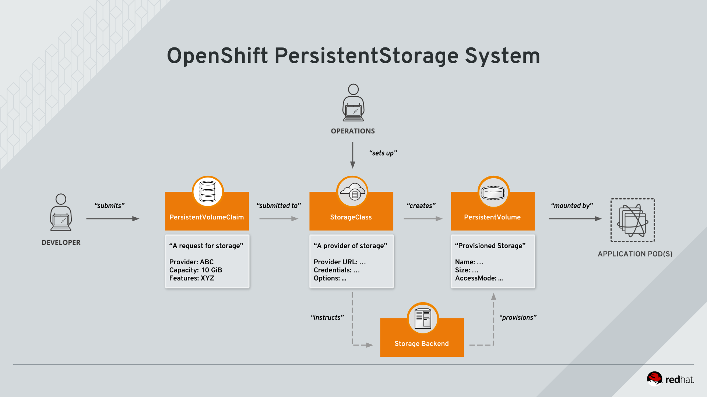
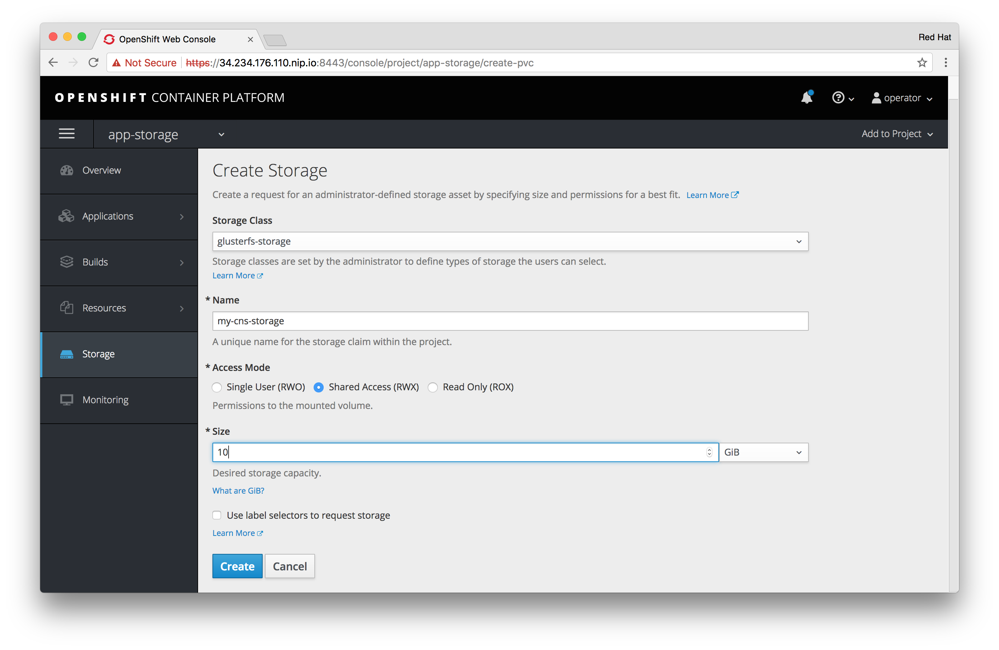
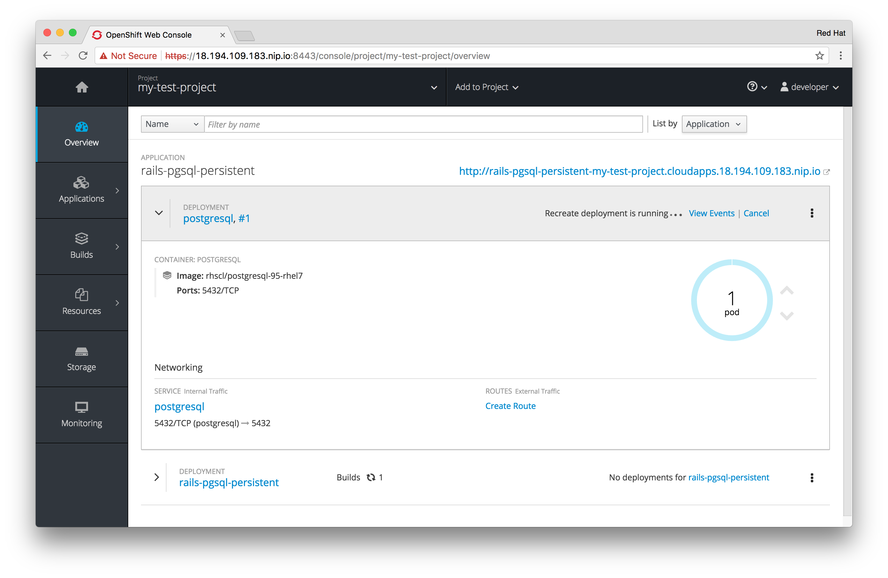
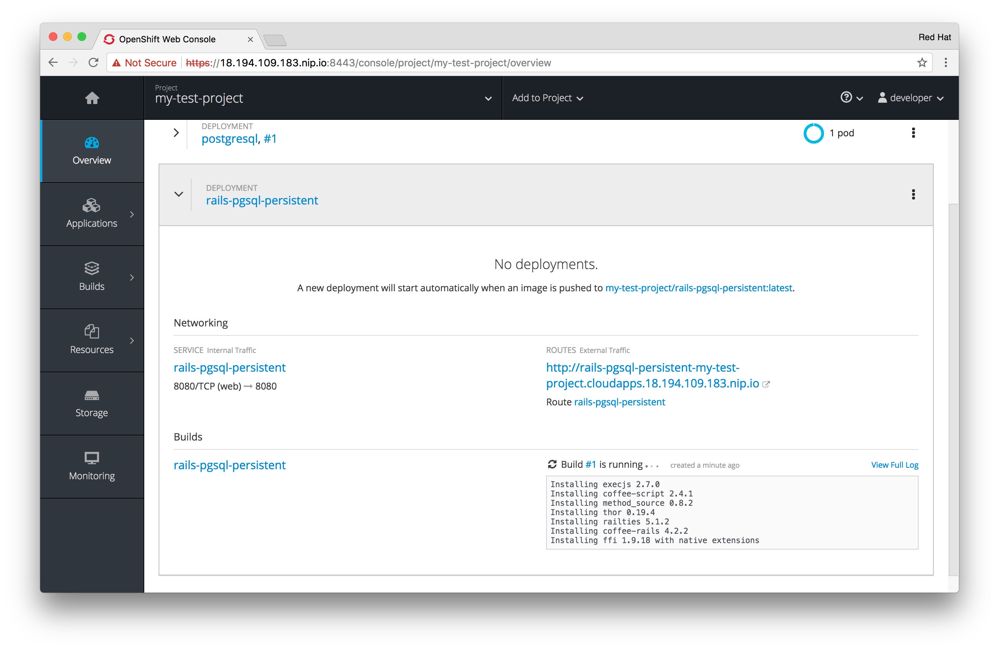
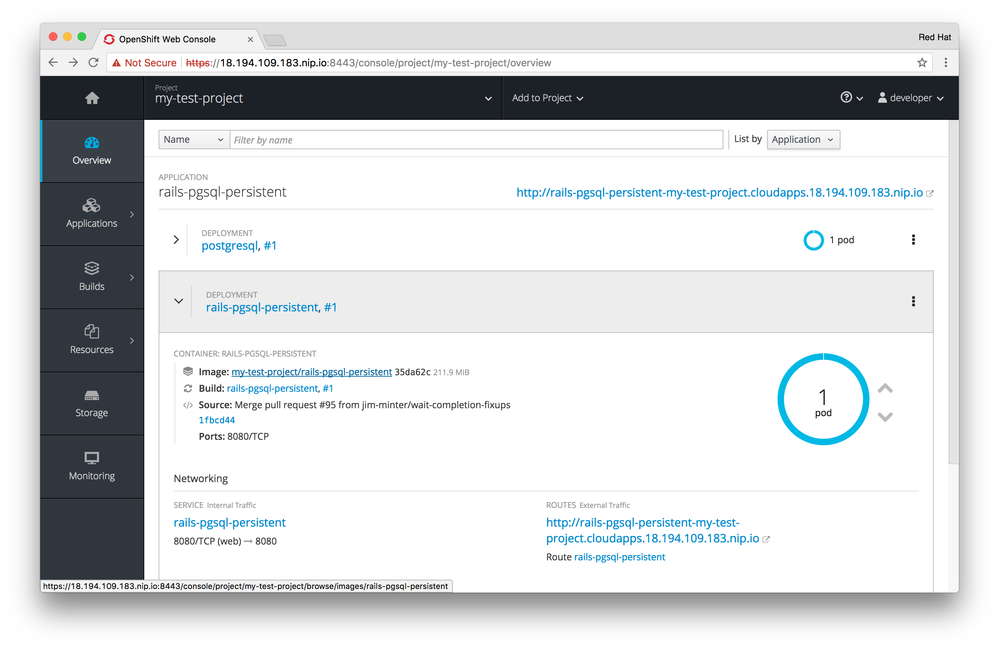
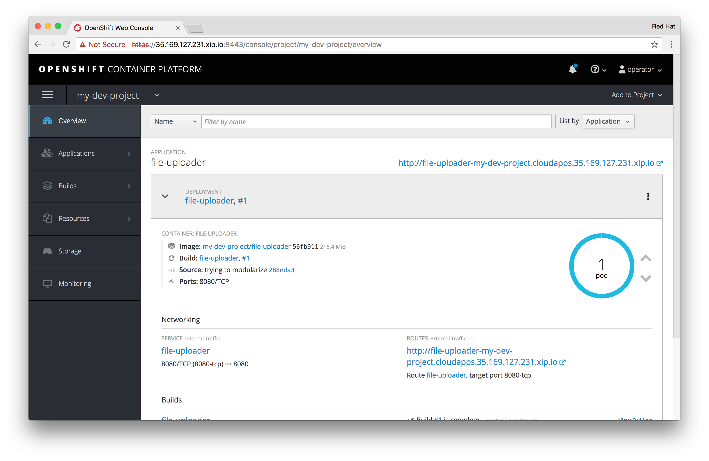
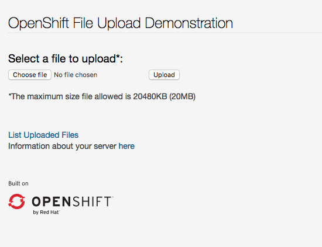
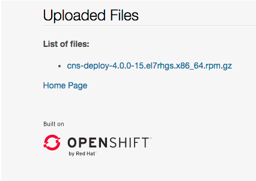
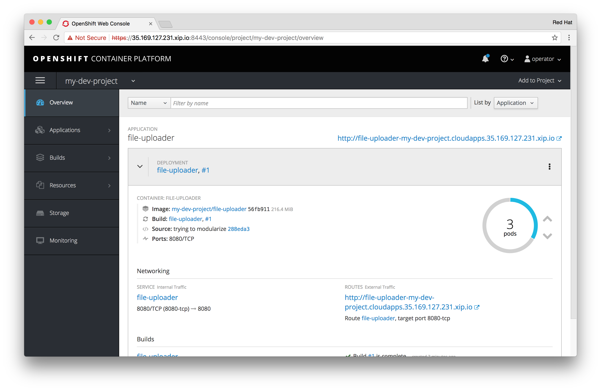
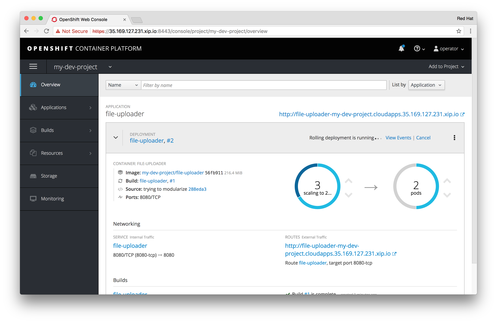

!!! Summary "Overview"
    In this module you will use CNS as a developer would do in OpenShift. For that purpose you will dynamically provision storage both in standalone fashion and in context of an application deployment.
    This module requires that you have completed [Module 2](../module-2-deploy-cns/).

OpenShift Storage 101
---------------------

OpenShift uses Kubernetes' PersistentStorage facility to dynamically allocate storage of any kind for applications. This is a fairly simple framework in which only 3 components are relevant: the storage provider, the storage volume and the request for a storage volume.

[](img/cns_diagram_pvc.svg)

OpenShift knows non-ephemeral storage as "persistent" volumes. This is storage that is decoupled from pod lifecycles. Users can request such storage by submitting a `PersistentVolumeClaim` to the system, which carries aspects like desired capacity or access mode (shared, single, read-only).

A storage provider in the system is represented by a `StorageClass` and is referenced in the claim. Upon receiving the claim OpenShift talks to the API of the actual storage system to provision the storage.  

The provisioned storage is represented in OpenShift as a `PersistentVolume` which can directly be used by pods to mount it.

With these basics defined we can try CNS in our system. First examine the `StorageClass` the installer has automatically created for us.

&#8680; Remain logged in as `operator` for now:

    oc login -u operator

&#8680; Examine the `StorageClass` objects available:

    oc get storageclass

`openshift-ansible` defined a `StorageClass` for CNS:

~~~~
NAME                TYPE
glusterfs-storage   kubernetes.io/glusterfs
~~~~

&#8680; Let's look at the details:

    oc describe storageclass/glusterfs-storage

The output indicates the backing storage type: GlusterFS

~~~~
Name:		glusterfs-storage
IsDefaultClass:	No
Annotations:	<none>
Provisioner:	kubernetes.io/glusterfs
Parameters:	resturl=http://heketi-storage-app-storage.cloudapps.52.28.134.154.nip.io,restuser=admin,secretName=heketi-storage-admin-secret,secretNamespace=app-storage
~~~~

!!! Note:
    The exact value for `resturl` will again be different for you because it's based on the `route`/IP address on your system.

The *Provisioner* is a module in OpenShift/Kubernetes that can talk to the CNS API service: *heketi*. The parameters supplied in the `StorageClass` tell the *Provisioner* the URL of the API as well as the `admin` users (defined in `restuser`) password in the form of an OpenShift `secret` (`base64`'d hash of the password).
The *Provisioner* is not an entity directly accessible to users.

---

Requesting Storage
------------------

To get storage provisioned via this `StorageClass` as a user you have to "claim" storage. The object `PersistentVolumeClaim` (PVC) basically acts a request to the system to provision storage with certain properties, like a specific capacity.  
Also the access mode is set here, where *ReadWriteMany* allows one or more container in parallel to mount and access this storage. This capability is dependent on the storage backend. In our case, with GlusterFS, we have one of the few systems that can reliable implement shared storage.

&#8680; Create a claim by specifying a file called `cns-pvc.yml` with the following contents:

<kbd>cns-pvc.yml:</kbd>
```yaml
kind: PersistentVolumeClaim
apiVersion: v1
metadata:
  name: my-container-storage
spec:
  accessModes:
  - ReadWriteMany
  resources:
    requests:
      storage: 10Gi
  storageClassName: glusterfs-storage
```

With above PVC we are requesting 10 GiB of shared storage. Instead of *ReadWriteMany* you could also have specified *ReadWriteOnly* (for read-only) and *ReadWriteOnce* (for non-shared storage, where only one pod can mount at a time).

&#8680; Submit the PVC to the system like so:

    oc create -f cns-pvc.yml

&#8680; After a couple of seconds, look at the requests state with the following command:

    oc get pvc

You should see the PVC listed and in *Bound* state.

    NAME                   STATUS    VOLUME                                     CAPACITY   ACCESSMODES   STORAGECLASS        AGE
    my-container-storage   Bound     pvc-848cbc48-9fe3-11e7-83c3-022238c6a515   10Gi       RWX           glusterfs-storage   6s


!!! Caution
    If the PVC is stuck in *PENDING* state you will need to investigate. Run `oc describe pvc/my-container-storage` to see a more detailed explanation. Typically there are two root causes - the StorageClass is not properly specified in the `PVC` (wrong name, not specified) or (less likely here) the backing storage system has a problem (in our case: error on heketi side, incorrect URL in `StorageClass`, etc.)

!!! Tip
    Alternatively, you can also do this step with the UI. Log on as `operator` and select any Project. Then go to the "Storage" tab. Select "Create" storage and make selections accordingly to the PVC described before.

    [](img/openshift_pvc_create.png)

When the claim was fulfilled successfully it is in the *Bound* state. That means the system has successfully (via the `StorageClass`) reached out to the storage backend (in our case GlusterFS). The backend in turn provisioned the storage and provided a handle back OpenShift. In OpenShift the provisioned storage is then represented by a `PersistentVolume` (PV) which is *bound* to the PVC.

&#8680; Look at the PVC for these details:

    oc describe pvc/my-container-storage

The details of the PVC show all the desired properties of the requested storage and against which `StorageClass` it has been submitted. Since it's already bound thanks to dynamic provisioning it also displays the name of the `PersistentVolume` which was generated to fulfil the claim.
The name of the `PV` always follows the pattern `pvc-...`.

``` hl_lines="1 5"
Name:           my-container-storage
Namespace:      app-storage
StorageClass:   glusterfs-storage
Status:         Bound
Volume:         pvc-848cbc48-9fe3-11e7-83c3-022238c6a515
Labels:         <none>
Annotations:    pv.kubernetes.io/bind-completed=yes
                pv.kubernetes.io/bound-by-controller=yes
                volume.beta.kubernetes.io/storage-provisioner=kubernetes.io/glusterfs
Capacity:       10Gi
Access Modes:   RWX
Events:
  FirstSeen	LastSeen	Count	From				SubObjectPath	Type		Reason			Message
  ---------	--------	-----	----				-------------	--------	------			-------
  10m		10m		1	persistentvolume-controller			Normal		ProvisioningSucceeded	Successfully provisioned volume pvc-848cbc48-9fe3-11e7-83c3-022238c6a515 using kubernetes.io/glusterfs
```

!!! Note
    The `PV` name will be different in your environment since it’s automatically generated.

In order to look at a the details of a `PV` in a default setup like this you need more privileges.

&#8680; Look at the corresponding `PV` by it’s name. Use the following command which stores the exact name in an environment variable extracted by an `oc` command for copy&paste-friendliness:

~~~~
PV_NAME=$(oc get pvc/my-container-storage -o jsonpath="{.spec.volumeName}")
oc describe pv/${PV_NAME}
~~~~

The output shows several interesting things, like the access mode (RWX = ReadWriteMany), the reclaim policy (what happens when the PV object gets deleted), the capacity and the type of storage backing this PV (in our case GlusterFS as part of CNS):

``` hl_lines="7 9 10 11 12 15"
Name:           pvc-848cbc48-9fe3-11e7-83c3-022238c6a515
Labels:         <none>
Annotations:    pv.beta.kubernetes.io/gid=2001
                pv.kubernetes.io/bound-by-controller=yes
                pv.kubernetes.io/provisioned-by=kubernetes.io/glusterfs
                volume.beta.kubernetes.io/mount-options=auto_unmount
StorageClass:   glusterfs-storage
Status:         Bound
Claim:          app-storage/my-container-storage
Reclaim Policy: Delete
Access Modes:   RWX
Capacity:       10Gi
Message:
Source:
  Type:         Glusterfs (a Glusterfs mount on the host that shares a pod's lifetime)
  EndpointsName:glusterfs-dynamic-my-container-storage
  Path:         vol_7e1733b13e1b46c028a71590f8cfe8b5
  ReadOnly:     false
Events:         <none>
```

Note how all the properties exactly match up with what the `PVC` requested.

!!! Tip "Why is it called *Bound*?"
    Originally `PVs` weren't automatically created. Hence in earlier documentation you may also find references about administrators actually **pre-provisioning** `PVs`. Later `PVCs` would "pick up"/match a suitable `PV` by looking at it’s capacity and access mode. When successful they are *bound* to this `PV`.
    This was needed for storage like NFS that does not have an API and therefore does not support **dynamic provisioning**. That's called **static provisioning**.
    This kind of storage should not be used anymore as it requires manual intervention, risky capacity planning and incurs inefficient storage utilization.

Although the storage is provisioned on the GlusterFS side it's not yet used by any application/pod/host. So let’s release this storage capacity again.
Storage is freed up by deleting the `PVC`. The `PVC` controls the lifecycle of the storage, not the `PV`.

!!! Caution "Important"
    Never delete `PVs` that are dynamically provided. They are only handles for pods mounting the storage. With dynamic provisioning storage lifecycle is entirely controlled via `PVCs`.

&#8680; Delete the storage by deleting the `PVC` like this:

    oc delete pvc/my-container-storage

---

Make CNS the default storage
----------------------------

For the following example it is required to make the `StorageClass` that got created for CNS the system-wide default. This simplifies the following steps.

&#8680; Use the `oc patch` command to change the definition of the `StorageClass` on the fly:

    oc patch storageclass glusterfs-storage \
    -p '{"metadata": {"annotations": {"storageclass.kubernetes.io/is-default-class": "true"}}}'

&#8680; Look at the `StorageClass` again to see the change reflected:

    oc describe storageclass/glusterfs-storage

Verify it's indeed the default (see highlighted line):

~~~~ hl_lines="2"
Name:           glusterfs-storage
IsDefaultClass: Yes
Annotations:	<none>
Provisioner:	kubernetes.io/glusterfs
Parameters:     resturl=http://heketi-storage-app-storage.cloudapps.52.28.134.154.nip.io,restuser=admin,secretName=heketi-storage-admin-secret,secretNamespace=app-storage
~~~~

!!! Danger "Important"
    It is crucial that you **do not skip this step** as it is fundamental for the next example to work.

---

Using non-shared storage for databases
--------------------------------------


Normally a user doesn’t request storage with a `PVC` directly. Rather the `PVC` is part of a larger template that describes the entire application stack. Such examples ship with OpenShift out of the box.

!!! Tip "Alternative"
    The steps described in this section to launch the Rails/Postgres example app can again also be done with the UI. For this purpose follow these steps similar to the one in Module 1:

    > 1.  Log on to the OpenShift UI as the `developer` user

    > 1.  Create a new project called 'my-test-project', label and description is optional

    > 1.  In the Overview, next to the project’s name select *Add to project*

    > 1.  In the *Browse Catalog* view select *Ruby* from the list of programming languages

    > 1.  Select the example app entitled *Rails + PostgreSQL (Persistent)*

    > 1.  (optional) Change the *Volume Capacity* parameter to 5GiB

    > 1.  Select *Create* to start deploying the app

    > 1.  Select *Continue to Overview* in the confirmation screen

    > 1.  Wait for the application deployment to finish and continue below at

---

To create an application from the OpenShift Example templates on the CLI follow these steps.

&#8680; Log in as `developer` and the password `r3dh4t`

    oc login -u developer

&#8680; Create a new project with a name of your choice:

    oc new-project my-test-project

To use the example applications that ship with OpenShift we can use the `new-app` command of the `oc` client. It will allow us to specify one of the  application stack templates in the system. There are a lot of example templates that ship in the pre-defined namespace called `openshift` which is the default place where `oc new-app` will look.

Let's pick a database application that definitely needs persistent storage. It's going to be part of a simple example blog application based on Rails and PostgreSQL.

&#8680; Instantiate this application with the following command

    oc new-app rails-pgsql-persistent -p VOLUME_CAPACITY=5Gi

Among various OpenShift resources also our `PVC` will be created:

``` hl_lines="7"
[...output omitted...]
secret "rails-pgsql-persistent" created
service "rails-pgsql-persistent" created
route "rails-pgsql-persistent" created
imagestream "rails-pgsql-persistent" created
buildconfig "rails-pgsql-persistent" created
deploymentconfig "rails-pgsql-persistent" created
persistentvolumeclaim "postgresql" created
service "postgresql" created
deploymentconfig "postgresql" created
```

The deployment process for the application stack continues in the background.

We have given the `new-app` command an additional switch: `-p VOLUME_CAPACITY=5Gi`. This causes a parameter in the template called `VOLUME_CAPACITY` to be set to 5GiB. Parameters make templates more generic. In our case the template contains a `PersistentVolumeClaim` (like highlighted above) which will take it's size from this parameter.

!!! Hint "What other parameters does this template have?"
    Plenty. If you are interested about all the variables/parameters this particular template supports, you can run `oc process openshift//rails-pgsql-persistent --parameters`.

!!! Hint "What else does the template file contain?"
    The template describes all OpenShift resources necessary to stand up the rails pod and the postgres pod and make them accessible via services and routes. If you are curious: `oc get template/rails-pgsql-persistent -n openshift -o yaml`
    In essence it creates Ruby on Rails instance in a pod which functionality mimics a very basic blogging application. The blog articles are saved in a PostgreSQL database that runs in a separate pod.
    Above mentioned `PVC` can be found there as well (around line 194) which supplies the postgres pod with persistent storage below the mount point `/var/lib/pgsql/data` (around line 275).


You can now either use the OpenShift UI (while being logged as `developer` in the project `my-test-project`) or the CLI to follow the deployment process.

In the UI you will observe both pods deploying like this:

[](img/openshift_rails_app_create_1.png)

[](img/openshift_rails_app_create_2.png)

&#8680; On the CLI watch the containers deploy like this:

    oc get pods -w

The complete output should look like this:

    NAME                             READY     STATUS              RESTARTS   AGE
    postgresql-1-deploy              0/1       ContainerCreating   0          11s
    rails-pgsql-persistent-1-build   0/1       ContainerCreating   0          11s
    NAME                  READY     STATUS    RESTARTS   AGE
    postgresql-1-deploy   1/1       Running   0          14s
    postgresql-1-81gnm   0/1       Pending   0         0s
    postgresql-1-81gnm   0/1       Pending   0         0s
    rails-pgsql-persistent-1-build   1/1       Running   0         19s
    postgresql-1-81gnm   0/1       Pending   0         15s
    postgresql-1-81gnm   0/1       ContainerCreating   0         16s
    postgresql-1-81gnm   0/1       Running   0         47s
    postgresql-1-81gnm   1/1       Running   0         4m
    postgresql-1-deploy   0/1       Completed   0         4m
    postgresql-1-deploy   0/1       Terminating   0         4m
    postgresql-1-deploy   0/1       Terminating   0         4m
    rails-pgsql-persistent-1-deploy   0/1       Pending   0         0s
    rails-pgsql-persistent-1-deploy   0/1       Pending   0         0s
    rails-pgsql-persistent-1-deploy   0/1       ContainerCreating   0         0s
    rails-pgsql-persistent-1-build   0/1       Completed   0         11m
    rails-pgsql-persistent-1-deploy   1/1       Running   0         6s
    rails-pgsql-persistent-1-hook-pre   0/1       Pending   0         0s
    rails-pgsql-persistent-1-hook-pre   0/1       Pending   0         0s
    rails-pgsql-persistent-1-hook-pre   0/1       ContainerCreating   0         0s
    rails-pgsql-persistent-1-hook-pre   1/1       Running   0         6s
    rails-pgsql-persistent-1-hook-pre   0/1       Completed   0         15s
    rails-pgsql-persistent-1-dkj7w   0/1       Pending   0         0s
    rails-pgsql-persistent-1-dkj7w   0/1       Pending   0         0s
    rails-pgsql-persistent-1-dkj7w   0/1       ContainerCreating   0         0s
    rails-pgsql-persistent-1-dkj7w   0/1       Running   0         1m
    rails-pgsql-persistent-1-dkj7w   1/1       Running   0         1m
    rails-pgsql-persistent-1-deploy   0/1       Completed   0         1m
    rails-pgsql-persistent-1-deploy   0/1       Terminating   0         1m
    rails-pgsql-persistent-1-deploy   0/1       Terminating   0         1m
    rails-pgsql-persistent-1-hook-pre   0/1       Terminating   0         1m
    rails-pgsql-persistent-1-hook-pre   0/1       Terminating   0         1m

Exit out of the watch mode with: <kbd>Ctrl</kbd> + <kbd>c</kbd>

!!! Note:
    It may take up to 5-7 minutes for the deployment to complete.

    If you did it via the UI the deployment is finished when both, rails app and postgres database are up and running:

    [](img/openshift_rails_app_create_3.png)

You should also see a PVC being issued and in the *Bound* state.

&#8680; Look at the PVC created:

    oc get pvc/postgresql

Output:

    NAME         STATUS    VOLUME                                     CAPACITY   ACCESSMODES   AGE
    postgresql   Bound     pvc-6c348fbb-4e9d-11e7-970e-0a9938370404   15Gi       RWO           4m

Now go ahead and try out the application. The overview page in the OpenShift UI will tell you the `route` which has been deployed as well (the http://... link in the upper right hand corner). Use it and append `/articles` to the URL to get to the actual app.

&#8680; Otherwise get it on the CLI like this:

    oc get route

Output:

    NAME                     HOST/PORT                                                               PATH      SERVICES                 PORT      TERMINATION   WILDCARD
    rails-pgsql-persistent   rails-pgsql-persistent-my-test-project.cloudapps.34.252.58.209.nip.io             rails-pgsql-persistent   <all>                   None

!!! Note:
    Again, the URL will be slightly different for you.

Following this output, point your browser to the URL (prepend it with `http://` and append **/articles**) to reach the actual application, in this case:

http://*rails-pgsql-persistent-my-test-project.cloudapps.**<YOUR-IP-HERE\>**.nip.io*/**articles**

You should be able to successfully create articles and comments. The username/password to create articles and comments is by default **openshift**/**secret**.
When they are saved they are actually saved in the PostgreSQL database which stores it’s table spaces on a GlusterFS volume provided by CNS.

&#8680; You can verify that the postgres pod indeed mounted the PVC under the pather where PostgreSQL normally stores it's data with this command:

    oc volumes dc --all

You will see that the `DeploymentConfig` of the postgres pod did indeed include a `PVC`:

    deploymentconfigs/postgresql
      pvc/postgresql (allocated 5GiB) as postgresql-data
        mounted at /var/lib/pgsql/data
    deploymentconfigs/rails-pgsql-persistent

Now let’s take a look at how this was actually achieved.

&#8680; A normal user cannot see the details of a `PersistentVolume`. Log back in as `operator`:

    oc login -u operator -n my-test-project

&#8680; Look at the PVC to determine the PV:

    oc get pvc

Output:

    NAME         STATUS    VOLUME                                     CAPACITY   ACCESSMODES   AGE
    postgresql   Bound     pvc-6c348fbb-4e9d-11e7-970e-0a9938370404   5Gi       RWO           10m

!!! Note
    Your volume (PV) name will be different as it’s dynamically generated.

The PVC name is found in above output the `VOLUME` column.

&#8680; Look at the details of this PV with the following copy&paste-friendly short-hand:

~~~~
PV_NAME=$(oc get pvc/postgresql -o jsonpath="{.spec.volumeName}")
oc describe pv/${PV_NAME}
~~~~

Output shows (in highlight) the name of the volume, the backend type (GlusterFS) and the volume name GlusterFS uses internally.

``` hl_lines="1 15 17"
Name:             pvc-c638ba71-a070-11e7-890c-02ed99595f95
Labels:           <none>
Annotations:      pv.beta.kubernetes.io/gid=2000
                  pv.kubernetes.io/bound-by-controller=yes
                  pv.kubernetes.io/provisioned-by=kubernetes.io/glusterfs
                  volume.beta.kubernetes.io/mount-options=auto_unmount
StorageClass:     glusterfs-storage
Status:           Bound
Claim:            my-test-project/postgresql
Reclaim Policy:   Delete
Access Modes:     RWO
Capacity:         5Gi
Message:
Source:
  Type:           Glusterfs (a Glusterfs mount on the host that shares a pod's lifetime)
  EndpointsName:  glusterfs-dynamic-postgresql
  Path:           vol_4b22dda4c9681f4325ba5e24cb4f64c6
  ReadOnly:       false
Events:           <none>
```

Note the GlusterFS volume name, in this case `vol_4b22dda4c9681f4325ba5e24cb4f64c6`.

&#8680; Save the generated volume name of GlusterFS in a shell variable for later use:

    GLUSTER_VOL_NAME=$(oc get pv/${PV_NAME} -o jsonpath="{.spec.glusterfs.path}")

&#8680; Now let’s switch to the namespace we used for CNS deployment:

    oc project app-storage

&#8680; Look at the GlusterFS pods (filtered by label) running:

    oc get pods -o wide -l glusterfs=storage-pod

Pick the first of the GlusterFS pods in the list:

~~~~ hl_lines="2"
NAME                      READY     STATUS    RESTARTS   AGE       IP           NODE
glusterfs-storage-16pb0   1/1       Running   0          23m       10.0.2.201   node-1.lab
glusterfs-storage-37tqx   1/1       Running   0          23m       10.0.4.203   node-3.lab
glusterfs-storage-68lxn   1/1       Running   0          23m       10.0.3.202   node-2.lab
~~~~

Pick the first the pod in the list, in this example *glusterfs-storage-16pb0* and note it's host IP address.

&#8680; Use the following command to conveniently save it's name and host IP address in a shell variable for later use (copy & paste those lines in your shell):

~~~~
FIRST_GLUSTER_POD=$(oc get pods -l glusterfs=storage-pod -o jsonpath="{.items[0].metadata.name}")
HOST_IP=$(oc get pod/$FIRST_GLUSTER_POD -o jsonpath="{.status.hostIP}")
echo $FIRST_GLUSTER_POD
echo $HOST_IP
~~~~

Next we are going to use the remote session capability of the `oc` client to execute a command in that pods namespace. We are going to leverage the GlusterFS CLI utilities being present in that pod.

&#8680; Ask GlusterFS from inside the CNS pod about all the GlusterFS volumes defined:

    oc rsh $FIRST_GLUSTER_POD gluster vol list

You will see two volumes:

    heketidbstorage
    vol_4b22dda4c9681f4325ba5e24cb4f64c6

-   `heketidbstorage` is an internal-only volume dedicated to heketi’s internal database.

-   the second is the volume backing the PV of the PostgreSQL database deployed earlier, in this example `vol_4b22dda4c9681f4325ba5e24cb4f64c6` - your's will be differently named.

&#8680; Ask GlusterFS about the topology of this volume:

    oc rsh $FIRST_GLUSTER_POD gluster vol info $GLUSTER_VOL_NAME

The output of the `gluster` command will show you how the volume has been created. You will also see that the pod you are currently logged on to serves one the bricks.

``` hl_lines="9 10 11"
Volume Name: vol_4b22dda4c9681f4325ba5e24cb4f64c6
Type: Replicate
Volume ID: 37d53d51-34bc-4853-b564-3b0ea9bdd935
Status: Started
Snapshot Count: 0
Number of Bricks: 1 x 3 = 3
Transport-type: tcp
Bricks:
Brick1: 10.0.2.201:/var/lib/heketi/mounts/vg_50f5d808e04ccab8d6fd0231c268db35/brick_4b59cd1f4a8ff8d8a3eddf7317829e73/brick
Brick2: 10.0.4.203:/var/lib/heketi/mounts/vg_7cb3be478376539d0c4b54cf69688c8e/brick_688627cc5dca8d01a81fa504487116c0/brick
Brick3: 10.0.3.202:/var/lib/heketi/mounts/vg_fb1a45c7853f415a3a09a164f0d717fb/brick_931730cb987383a605c1d1ff5d796fa9/brick
Options Reconfigured:
transport.address-family: inet
performance.readdir-ahead: on
nfs.disable: on
```

The above output tells us GlusterFS created this volume as a 3-way replica set across 3 bricks. Bricks are local directories on GlusterFS nodes. They make up replication targets.
In our case the GlusterFS nodes are our CNS pods and since they share the physical hosts network they are displayed with these IP addresses (see highlighted lines) . This volume type `Replicate` is currently the only supported volume type in production. It synchronously replicates all data across those 3 bricks.

Let's take a look at what's inside a brick.

&#8680; Paste this little piece of bash magic into your shell to conveniently store the brick directory from the first CNS pod you saw earlier in an environment variable:

~~~~
BRICK_DIR=$(echo -n $(oc rsh $FIRST_GLUSTER_POD gluster vol info $GLUSTER_VOL_NAME | grep $HOST_IP) | cut -d ':' -f 3 | tr -d $'\r' )
echo $BRICK_DIR
~~~~

&#8680; Now let's look at a brick directory from inside a CNS pod:

    oc rsh $FIRST_GLUSTER_POD ls -ahl $BRICK_DIR

What you see is the content of the brick directory from within the GlusterFS pod, which makes up 1 out of 3 copies of our postgres volume:

~~~~
total 16K
drwxrwsr-x.   5 root       2001   57 Jun  6 14:44 .
drwxr-xr-x.   3 root       root   19 Jun  6 14:44 ..
drw---S---. 263 root       2001 8.0K Jun  6 14:46 .glusterfs
drwxr-sr-x.   3 root       2001   25 Jun  6 14:44 .trashcan
drwx------.  20 1000080000 2001 8.0K Jun  6 14:46 userdata
~~~~

&#8680; Going one level deeper, we see a data structure familiar to PostgreSQL users:

    oc rsh $FIRST_GLUSTER_POD ls -ahl $BRICK_DIR/userdata

This is one of 3 copies of the postgres data directory hosted by CNS:

~~~~
total 68K
drwx------. 20 1000080000 2001 8.0K Jun  6 14:46 .
drwxrwsr-x.  5 root       2001   57 Jun  6 14:44 ..
-rw-------.  2 1000080000 root    4 Jun  6 14:44 PG_VERSION
drwx------.  6 1000080000 root   54 Jun  6 14:46 base
drwx------.  2 1000080000 root 8.0K Jun  6 14:47 global
drwx------.  2 1000080000 root   18 Jun  6 14:44 pg_clog
drwx------.  2 1000080000 root    6 Jun  6 14:44 pg_commit_ts
drwx------.  2 1000080000 root    6 Jun  6 14:44 pg_dynshmem
-rw-------.  2 1000080000 root 4.6K Jun  6 14:46 pg_hba.conf
-rw-------.  2 1000080000 root 1.6K Jun  6 14:44 pg_ident.conf
drwx------.  2 1000080000 root   32 Jun  6 14:46 pg_log
drwx------.  4 1000080000 root   39 Jun  6 14:44 pg_logical
drwx------.  4 1000080000 root   36 Jun  6 14:44 pg_multixact
drwx------.  2 1000080000 root   18 Jun  6 14:46 pg_notify
drwx------.  2 1000080000 root    6 Jun  6 14:44 pg_replslot
drwx------.  2 1000080000 root    6 Jun  6 14:44 pg_serial
drwx------.  2 1000080000 root    6 Jun  6 14:44 pg_snapshots
drwx------.  2 1000080000 root    6 Jun  6 14:46 pg_stat
drwx------.  2 1000080000 root   84 Jun  6 15:16 pg_stat_tmp
drwx------.  2 1000080000 root   18 Jun  6 14:44 pg_subtrans
drwx------.  2 1000080000 root    6 Jun  6 14:44 pg_tblspc
drwx------.  2 1000080000 root    6 Jun  6 14:44 pg_twophase
drwx------.  3 1000080000 root   60 Jun  6 14:44 pg_xlog
-rw-------.  2 1000080000 root   88 Jun  6 14:44 postgresql.auto.conf
-rw-------.  2 1000080000 root  21K Jun  6 14:46 postgresql.conf
-rw-------.  2 1000080000 root   46 Jun  6 14:46 postmaster.opts
-rw-------.  2 1000080000 root   89 Jun  6 14:46 postmaster.pid
~~~~


You are looking at the PostgreSQL internal data file structure from the perspective of the GlusterFS server side. Evidence that the database uses CNS.

Clients, like the OpenShift nodes and their application pods talk to this storage with the GlusterFS protocol as it were an ordinary local mounts.
When a pod starts that mounts storage from a `PV` backed by CNS the GlusterFS mount plugin in OpenShift will mount the GlusterFS volume on the right OpenShift node and then *bind-mount* this directory to the right pod's file namespace.  
This happens transparently to the application and looks like a normal local filesystem inside the pod as you just saw. Let's have a look from the container host perspective:

&#8680; Get the name and the host IP of the postgres pod with this shell shortcut into environment variables for easy copy&paste later:

~~~~
POSTGRES_POD=$(oc get pods -l name=postgresql -n my-test-project -o jsonpath="{.items[0].metadata.name}")
POSTGRES_CONTAINER_HOST=$(oc get pod/$POSTGRES_POD -n my-test-project -o jsonpath="{.status.hostIP}")
echo $POSTGRES_POD
echo $POSTGRES_CONTAINER_HOST
~~~~

Since you are acting from the master node `master.lab` you can use SSH without password to execute a remote command on the OpenShift node hosting the postgres pod.

&#8680; Look for the GlusterFS mount points on the host, searching the GlusterFS volume that was provisioned for the database

    ssh $POSTGRES_CONTAINER_HOST mount | grep $GLUSTER_VOL_NAME

!!! Tip:
    Answer the SSH clients question *"Are you sure you want to continue connecting (yes/no)?"* with *yes*.

The host should have mounted this GlusterFS volume, for example:

    10.0.2.201:vol_4b22dda4c9681f4325ba5e24cb4f64c6 on /var/lib/origin/openshift.local.volumes/pods/c7029a5a-a070-11e7-890c-02ed99595f95/volumes/kubernetes.io~glusterfs/pvc-c638ba71-a070-11e7-890c-02ed99595f95 type fuse.glusterfs (rw,relatime,user_id=0,group_id=0,default_permissions,allow_other,max_read=131072)

This sums up the relationship between `PVCs`, `PVs`, GlusterFS volumes and container mounts in CNS.

The mounting and unmounting of GlusterFS volumes is faciliated automatically by the GlusterFS mount plugin that ships with OpenShift.

---

Providing shared storage to multiple application instances
----------------------------------------------------------

In the previous example we provisioned an RWO PV - the volume is only usable with one pod at a time. RWO is what most of the OpenShift storage backends support and it just happened to be default in the example template.
So far only very few options, like the basic NFS support existed, to provide a `PersistentVolume` to more than one container at once. The reason is that most supported storage backends are actually *block-based*. That is a block device is made available to one of the container hosts and is then formatted with an XFS filesystem, which is inherently not cluster-aware (cannot be safely written to from multiple Operating Systems / Containers).
GlusterFS on the other hand is a true scale-out cluster filesystem with distributed locking. Hence we can use the access mode **ReadWriteMany** on OpenShift.

With CNS this capability is now available to all OpenShift deployments, no matter where they are deployed. To demonstrate this capability with an application we will deploy a PHP-based file uploader that has multiple front-end instances sharing a common storage repository.

&#8680; Log back in as `developer` to our project `my-test-project`

    oc login -u developer -n my-test-project

&#8680; Next deploy the example application:

    oc new-app openshift/php:7.0~https://github.com/christianh814/openshift-php-upload-demo --name=file-uploader

!!! Note
    This is yet another way to build and launch an application from source code in OpenShift. The content before the ~ is the name of a Source-to-Image builder (a container that knows how to build applications of a certain type from source, in this case PHP) and the URL following is a GitHub repository hosting the source code.

Output:

    --> Found image a1ebebb (6 weeks old) in image stream "openshift/php" under tag "7.0" for "openshift/php:7.0"

        Apache 2.4 with PHP 7.0
        -----------------------
        Platform for building and running PHP 7.0 applications

        Tags: builder, php, php70, rh-php70

        * A source build using source code from https://github.com/christianh814/openshift-php-upload-demo will be created
          * The resulting image will be pushed to image stream "file-uploader:latest"
          * Use 'start-build' to trigger a new build
        * This image will be deployed in deployment config "file-uploader"
        * Port 8080/tcp will be load balanced by service "file-uploader"
          * Other containers can access this service through the hostname "file-uploader"

    --> Creating resources ...
        imagestream "file-uploader" created
        buildconfig "file-uploader" created
        deploymentconfig "file-uploader" created
        service "file-uploader" created
    --> Success
        Build scheduled, use 'oc logs -f bc/file-uploader' to track its progress.
        Run 'oc status' to view your app.

&#8680; Observe the application to be deployed with the suggested command:

    oc logs -f bc/file-uploader

The follow-mode of the above command ends automatically when the build is successful and you return to your shell.

~~~~
[ ...output omitted...]

Cloning "https://github.com/christianh814/openshift-php-upload-demo" ...
        Commit: 7508da63d78b4abc8d03eac480ae930beec5d29d (Update index.html)
        Author: Christian Hernandez <christianh814@users.noreply.github.com>
        Date:   Thu Mar 23 09:59:38 2017 -0700
---> Installing application source...
Pushing image 172.30.120.134:5000/my-test-project/file-uploader:latest ...
Pushed 0/5 layers, 2% complete
Pushed 1/5 layers, 20% complete
Pushed 2/5 layers, 40% complete
Push successful
~~~~

&#8680; When the build is completed ensure the pods are running:

    oc get pods

Among your existing pods you should see new pods running.

    NAME                             READY     STATUS      RESTARTS   AGE
    file-uploader-1-build            0/1       Completed   0          2m
    file-uploader-1-g7b0h            1/1       Running     0          1m
    ...

As part of the deployment a `Service` has been created for our app automatically. It load balances traffic to our PHP pods internally but not externally. For that a `Route` needs to expose it to the network outside of OpenShift.

&#8680; Let’s fix this:

    oc expose svc/file-uploader

&#8680; Check the route that has been created:

    oc get route/file-uploader

The route forwards all traffic on port 80 of it's automatically generated subdomain of the OpenShift router to port 8080 of the container running the app.

    NAME            HOST/PORT                                                      PATH      SERVICES        PORT       TERMINATION   WILDCARD
    file-uploader   file-uploader-my-test-project.cloudapps.34.252.58.209.nip.io             file-uploader   8080-tcp                 None

Point your browser to the URL advertised by the route, that is *http://file-uploader-my-test-project.cloudapps.**<YOUR-IP-HERE\>**.nip.io*

Alternatively, in the OpenShift UI, while logged on as `devleoper` to the project called `my-test-project`, click the **Down Arrow** in the **Overview** section next to the deployment called **file-uploader**. The URL to your app will be in the section called **ROUTES**.

[](img/uploader_app_route.png)

The application again is very simply: it lists all file previously uploaded files and offers the ability to upload new ones, as well as download the existing uploads. Right now there is nothing.

Try it out in your browser: select an arbitrary from your local system and upload it to the app.

[](img/uploader_screen_upload.png)

After uploading a file validate it has been stored successfully by following the link *List Uploaded Files* in the browser.

Let's see how this is stored locally in the container.

&#8680; List the running pods of our application:

    oc get pods -l app=file-uploader

You will see two entries:

    file-uploader-1-build            0/1       Completed   0          7m
    file-uploader-1-g7b0h            1/1       Running     0          6m

The name of the single pod currently running the app is this example is **file-uploader-1-g7b0h**.
The container called `file-uploader-1-build` is the builder container that deployed the application and it has already terminated.

!!! Note
    The exact name of the pod will be different in your environment.

&#8680; Use the following shell command to store the exact name of the `file-uploader` application pod in your environment in a shell variable called `UPLOADER_POD`:

~~~~
UPLOADER_POD=$(oc get pods -l app=file-uploader -o jsonpath="{.items[0].metadata.name}")
echo $UPLOADER_POD
~~~~

&#8680; Use the remote shell capability of the `oc` client to list the content of `uploaded/` directory inside the pod after you uploaded a file in the PHP app:

    oc rsh $UPLOADER_POD ls -ahl /opt/app-root/src/uploaded

In the below example output we've uploaded a file named `cns-deploy-4.0.0-15.el7rhgs.x86_64.rpm.gz` in the app via the browser, and we see it store from within the pod:

    total 16K
    -rw-r--r--. 1 1000080000 root 16K May 26 09:32 cns-deploy-4.0.0-15.el7rhgs.x86_64.rpm.gz

The app should also list the file in the overview:

[](img/uploader_screen_list.png)

However, in it's default configuration his pod currently does not use any persistent storage. It uses it's local filesystem - that is stores the file in inside the container image's root filesystem.

!!! Danger "Important"
    Never store important data inside a pods root filesystem or `emptyDir`. It’s ephemeral by definition and will be lost as soon as the pod terminates.
    Worse, the container's root filesystem is even slower than `emptyDir` as it needs to traverse the `overlay2` stack, that Red Hat Enterprise Linux uses by default as of version 7.4 for running container images.
    Also, inherently pods using this kind of storage cannot be scaled out trivially.

Let’s see when this become a problem.

&#8680; Let’s scale the deployment to 3 instances of the app:

    oc scale dc/file-uploader --replicas=3

&#8680; Watch the additional pods getting spawned:

    oc get pods -l app=file-uploader

You will see 2 additional pods being spawned:

    NAME                             READY     STATUS      RESTARTS   AGE
    file-uploader-1-3cgh1            1/1       Running     0          20s
    file-uploader-1-3hckj            1/1       Running     0          20s
    file-uploader-1-g7b0h            1/1       Running     0          3m

!!! Note
    The pod names will be different in your environment since they are automatically generated. It takes a couple of seconds until they are ready.

Alternatively, in the UI, wait for the `file-uploader` application reach 3 healthy pods (the blue circle is completely filled):

[](img/uploader_scaled.png)

On the command line this will look like this:

    oc get pods -l app=file-uploader

~~~~
NAME                    READY     STATUS    RESTARTS   AGE
file-uploader-1-98fwm   1/1       Running   0          2m
file-uploader-1-g7b0h   1/1       Running   0          8m
file-uploader-1-rwt2p   1/1       Running   0          2m
~~~~

These 3 pods now make up our application. OpenShift will load balance incoming traffic between them.
However, when you log on to one of the new instances you will see they have no data.

&#8680; Store the names of all in some environment variables for easy copy&paste:

~~~~
UPLOADER_POD_1=$(oc get pods -l app=file-uploader -o jsonpath="{.items[0].metadata.name}")
UPLOADER_POD_2=$(oc get pods -l app=file-uploader -o jsonpath="{.items[1].metadata.name}")
UPLOADER_POD_3=$(oc get pods -l app=file-uploader -o jsonpath="{.items[2].metadata.name}")
~~~~

&#8680; Lets check all upload directories of all pods:

~~~~
oc rsh $UPLOADER_POD_1 ls -ahl /opt/app-root/src/uploaded
oc rsh $UPLOADER_POD_2 ls -ahl /opt/app-root/src/uploaded
oc rsh $UPLOADER_POD_3 ls -ahl /opt/app-root/src/uploaded
~~~~

Oh oh, only one of the pods has the previously uploaded file. Looks like our application data is not consistent anymore:

~~~~
oc rsh $UPLOADER_POD_1 ls -ahl /opt/app-root/src/uploaded
total 0
drwxrwxr-x. 2 default root  22 Sep 24 11:31 .
drwxrwxr-x. 1 default root 124 Sep 24 11:31 ..
-rw-rw-r--. 1 default root   0 Sep 24 11:31 .gitkeep

oc rsh $UPLOADER_POD_2 ls -ahl /opt/app-root/src/uploaded
total 108K
drwxrwxr-x. 1 default    root   52 Sep 24 11:35 .
drwxrwxr-x. 1 default    root   22 Sep 24 11:31 ..
-rw-rw-r--. 1 default    root    0 Sep 24 11:31 .gitkeep
-rw-r--r--. 1 1000080000 root  16K May 26 09:32 cns-deploy-4.0.0-15.el7rhgs.x86_64.rpm.gz

oc rsh $UPLOADER_POD_3 ls -ahl /opt/app-root/src/uploaded
total 0
drwxrwxr-x. 2 default root  22 Sep 24 11:31 .
drwxrwxr-x. 1 default root 124 Sep 24 11:31 ..
-rw-rw-r--. 1 default root   0 Sep 24 11:31 .gitkeep
~~~~

It's empty because the previously uploaded files were stored locally in the first container and are not available to the others.

Similarly, other users of the app will sometimes see your uploaded files and sometimes not. With the deployment scaled to 3 instances OpenShifts router will simply round-robin across them. You can simulate this with another instance of your browser in "Incognito mode" pointing to your app.

The app is of course not usable like this. We can fix this by providing shared storage to this app.

&#8680; First create a `PVC` with the appropriate setting in a file called `cns-rwx-pvc.yml` with below contents:

<kbd>cns-rwx-pvc.yml:</kbd>
```yaml
kind: PersistentVolumeClaim
apiVersion: v1
metadata:
  name: my-shared-storage
spec:
  accessModes:
  - ReadWriteMany
  resources:
    requests:
      storage: 5Gi
  storageClassName: glusterfs-storage
```

Notice the access mode explicitly requested to be `ReadWriteMany` (also referred to as `RWX`). Storage provisioned like this can be mounted by multiple containers on multiple hosts at the same time.

&#8680; Submit the request to the system:

    oc create -f cns-rwx-pvc.yml

&#8680; Let’s look at the result:

    oc get pvc

`ACCESSMODES` is set to `RWX`:

    NAME                STATUS    VOLUME                                     CAPACITY   ACCESSMODES   AGE
    my-shared-storage   Bound     pvc-62aa4dfe-4ad2-11e7-b56f-2cc2602a6dc8   10Gi       RWX           22s
    ...

We can now update the `DeploymentConfig` of our application to use this `PVC` to provide the application with persistent, shared storage for uploads.

&#8680; Update the configuration of the application by adding a volume claim like this:

    oc volume dc/file-uploader --add --name=shared-storage --type=persistentVolumeClaim --claim-name=my-shared-storage --mount-path=/opt/app-root/src/uploaded

Our app will now re-deploy (in a rolling fashion) with the new settings - all pods will mount the volume identified by the `PVC` under `/opt/app-root/src/upload` (the path is predictable so we can hard-code it here).

&#8680; You can watch it like this:

    oc logs dc/file-uploader -f

The new `DeploymentConfig` will supersede the old one.

~~~~
--> Scaling up file-uploader-2 from 0 to 3, scaling down file-uploader-1 from 3 to 0 (keep 3 pods available, don't exceed 4 pods)
    Scaling file-uploader-2 up to 1
    Scaling file-uploader-1 down to 2
    Scaling file-uploader-2 up to 2
    Scaling file-uploader-1 down to 1
    Scaling file-uploader-2 up to 3
    Scaling file-uploader-1 down to 0
--> Success
~~~~

Exit out of the follow mode with: <kbd>Ctrl</kbd> + <kbd>c</kbd>

!!! Warning
    Changing the storage settings of a pod can be destructive. Any existing data will **not be preserved**. You are responsible to care for data migration.
    One strategy here could have been to use `oc rsync` saving the data to a local directory on the machine running the `oc` client.

You can also observe the rolling upgrade of the file uploader application in the OpenShift UI:

[](img/uploader_upgrade.png)

The new `DeploymentConfig` named `file-uploader-2` will have 3 pods all sharing the same storage.

&#8680; Get the names of the new pods:

    oc get pods -l app=file-uploader

Output:

~~~~
NAME                             READY     STATUS      RESTARTS   AGE
file-uploader-1-build            0/1       Completed   0          18m
file-uploader-2-jd22b            1/1       Running     0          1m
file-uploader-2-kw9lq            1/1       Running     0          2m
file-uploader-2-xbz24            1/1       Running     0          1m
~~~~

Try it out in your application: upload new files and watch them being visible from within all application pods. In new browser *Incognito* sessions, simulating other users, the application behaves normally as it circles through the pods between browser requests.

That’s it. You have successfully provided shared storage to pods throughout the entire system, therefore avoiding the need for data to be replicated at the application level to each pod.

With CNS this is available wherever OpenShift is deployed with no external dependency.
