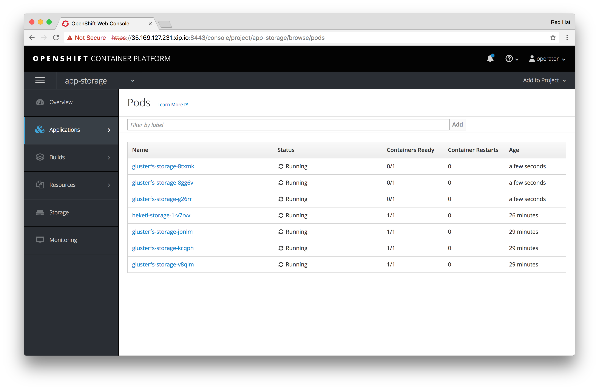

!!! Summary "Overview"
    In this module you be introduced to some standard operational procedures. You will learn how to run multiple GlusterFS *Trusted Storage Pools* on OpenShift and how to expand and maintain deployments.

    Herein, we will use the term pool (GlusterFS terminology) and cluster (`heketi` terminology) interchangeably.

    This module requires that you have completed [Module 2](../module-2-deploy-cns/).

Running multiple storage pools
------------------------------

In the previous modules a single GlusterFS cluster was used to supply `PersistentVolumes` to applications. CNS allows for multiple clusters to run in a single OpenShift deployment, controlled by a central `heketi` API:

There are several use cases for this:

1. Provide data isolation between clusters of different tenants

1. Provide multiple performance tiers of CNS, i.e. HDD-based vs. SSD-based

1. Run OpenShift across large geo-graphical distances with a CNS cluster per region whereas otherwise latency prohibits synchronous data replication in  a stretched setup

!!! Note:
    The procedures to add an additional CNS cluster to an existing setup is not yet supported by `openshift-ansible`.

Because we cannot use `openshift-ansible` as of today we need to run a couple of steps manually that would otherwise be automated.

To deploy a second CNS cluster, aka GlusterFS pool, follow these steps:

&#8680; Log in as `operator` to namespace `app-storage`

    oc login -u operator -n app-storage

Your deployment has 6 OpenShift Application Nodes in total, `node-1`, `node-2` and `node-3` currently setup running CNS. We will now set up a **second CNS cluster** using `node-4`, `node-5` and `node-6`.

First we need to make sure the firewall on those systems is updated. Without `openshift-ansible` automating CNS deployment the ports necessary for running GlusterFS are not yet opened.

&#8680; First, create a file called `configure-firewall.yml` and copy&paste the following contents:

<kbd>configure-firewall.yml:</kbd>
```yaml
---

- hosts:
    - node-4.lab
    - node-5.lab
    - node-6.lab

  tasks:

    - name: insert iptables rules required for GlusterFS
      blockinfile:
        dest: /etc/sysconfig/iptables
        block: |
          -A OS_FIREWALL_ALLOW -p tcp -m state --state NEW -m tcp --dport 24007 -j ACCEPT
          -A OS_FIREWALL_ALLOW -p tcp -m state --state NEW -m tcp --dport 24008 -j ACCEPT
          -A OS_FIREWALL_ALLOW -p tcp -m state --state NEW -m tcp --dport 2222 -j ACCEPT
          -A OS_FIREWALL_ALLOW -p tcp -m state --state NEW -m multiport --dports 49152:49664 -j ACCEPT
        insertbefore: "^COMMIT"

    - name: reload iptables
      systemd:
        name: iptables
        state: reloaded

...
```

&#8680; Run this small Ansible playbook to apply and reload the firewall configuration on all 3 nodes conveniently:

    ansible-playbook configure-firewall.yml

The playbook should complete successfully:

~~~~
PLAY [node-4.lab,node-5.lab,node-6.lab] ******************************************************************************************

TASK [Gathering Facts] ***********************************************************************************************************
Sunday 24 September 2017  14:02:50 +0000 (0:00:00.056)       0:00:00.056 ******
ok: [node-5.lab]
ok: [node-6.lab]
ok: [node-4.lab]

TASK [insert iptables rules required for GlusterFS] ******************************************************************************
Sunday 24 September 2017  14:02:51 +0000 (0:00:00.859)       0:00:00.916 ******
changed: [node-4.lab]
changed: [node-5.lab]
changed: [node-6.lab]

TASK [reload iptables] ***********************************************************************************************************
Sunday 24 September 2017  14:02:51 +0000 (0:00:00.268)       0:00:01.184 ******
changed: [node-6.lab]
changed: [node-5.lab]
changed: [node-4.lab]

PLAY RECAP ***********************************************************************************************************************
node-4.lab                 : ok=3    changed=2    unreachable=0    failed=0
node-5.lab                 : ok=3    changed=2    unreachable=0    failed=0
node-6.lab                 : ok=3    changed=2    unreachable=0    failed=0

Sunday 24 September 2017  14:02:52 +0000 (0:00:00.334)       0:00:01.519 ******
===============================================================================
Gathering Facts --------------------------------------------------------- 0.86s
reload iptables --------------------------------------------------------- 0.34s
insert iptables rules required for GlusterFS ---------------------------- 0.27s
~~~~

&#8680; Next, we need to apply additional labels to the remaining 3 OpenShift Nodes:

~~~~
oc label node/node-4.lab glusterfs=storage-host
oc label node/node-5.lab glusterfs=storage-host
oc label node/node-6.lab glusterfs=storage-host
~~~~

The label will be used to control GlusterFS pod placement and availability. They are part of a `DaemonSet` definition that is looking for hosts with this particular label.

&#8680; Wait for all pods to show `1/1` in the `READY` column:

     oc get pods -o wide -n app-storage

You can also watch the additional GlusterFS pods deploy in the OpenShift UI, while being logged in as `operator` in project `app-storage`, select **Applications** from the left menu and then **Pods**:

[](img/openshift_2nd_cns_pods.png)

!!! Note:
    It may take up to 3 minutes for the GlusterFS pods to transition into `READY` state.

&#8680; When done, on the CLI display all GlusterFS pods alongside with the name of the container host they are running on:

    oc get pods -o wide -n app-storage -l glusterfs=storage-pod

You will see that now also app nodes `node-4`, `node-5` and `node-6` run GlusterFS pods, although they are unitialized and not yet ready to use by CNS yet.

For manual bulk import of new nodes like this, a JSON topology file is used which includes the existing cluster as well as the new, second cluster with a separate set of nodes.

&#8680; Create a new file named `2-clusters-topology.json` with the content below (use copy&paste):

<kbd>2-clusters-topology.json:</kbd>

```json hl_lines="54"
{
    "clusters": [
        {
            "nodes": [
                {
                    "node": {
                        "hostnames": {
                            "manage": [
                                "node-1.lab"
                            ],
                            "storage": [
                                "10.0.2.201"
                            ]
                        },
                        "zone": 1
                    },
                    "devices": [
                        "/dev/xvdc"
                    ]
                },
                {
                    "node": {
                        "hostnames": {
                            "manage": [
                                "node-2.lab"
                            ],
                            "storage": [
                                "10.0.3.202"
                            ]
                        },
                        "zone": 2
                    },
                    "devices": [
                        "/dev/xvdc"
                    ]
                },
                {
                    "node": {
                        "hostnames": {
                            "manage": [
                                "node-3.lab"
                            ],
                            "storage": [
                                "10.0.4.203"
                            ]
                        },
                        "zone": 3
                    },
                    "devices": [
                        "/dev/xvdc"
                    ]
                }
            ]
        },
        {
            "nodes": [
                {
                    "node": {
                        "hostnames": {
                            "manage": [
                                "node-4.lab"
                            ],
                            "storage": [
                                "10.0.2.204"
                            ]
                        },
                        "zone": 1
                    },
                    "devices": [
                        "/dev/xvdc"
                    ]
                },
                {
                    "node": {
                        "hostnames": {
                            "manage": [
                                "node-5.lab"
                            ],
                            "storage": [
                                "10.0.3.205"
                            ]
                        },
                        "zone": 2
                    },
                    "devices": [
                        "/dev/xvdc"
                    ]
                },
                {
                    "node": {
                        "hostnames": {
                            "manage": [
                                "node-6.lab"
                            ],
                            "storage": [
                                "10.0.4.206"
                            ]
                        },
                        "zone": 3
                    },
                    "devices": [
                        "/dev/xvdc"
                    ]
                }
            ]
        }
    ]
}
```

The file contains the same content as the dynamically generated JSON structure `openshift-ansible` used, but with a second cluster specification (beginning at the highlighted line).

When loading this topology to `heketi`, it will recognize the existing cluster (leaving it unchanged) and start creating the new one, with the same bootstrapping process used to initialize the first cluster.
That is: the `glusterd` process running in the pods will form a new 3-node cluster and the supplied block storage device `/dev/xvdc` will be formatted.

&#8680; Prepare the heketi CLI tool like previously in [Module 2](module-2-deploy-cns.md#heketi-env-setup).

~~~~
HEKETI_POD=$(oc get pods -l glusterfs=heketi-storage-pod -n app-storage -o jsonpath="{.items[0].metadata.name}")
export HEKETI_CLI_SERVER=http://$(oc get route/heketi-storage -o jsonpath='{.spec.host}')
export HEKETI_CLI_USER=admin
export HEKETI_CLI_KEY=$(oc get pod/$HEKETI_POD -o jsonpath='{.spec.containers[0].env[?(@.name=="HEKETI_ADMIN_KEY")].value}')
~~~~

&#8680; Verify there is currently only a single cluster known to heketi

    heketi-cli cluster list

Example output:

    Clusters:
    fb67f97166c58f161b85201e1fd9b8ed

Your ID will be different since it's auto-generated.

&#8680; Save your specific ID of the first cluster with this shell command (and the versatile `jq` json parser) into an environment variable:

    FIRST_CNS_CLUSTER=$(heketi-cli cluster list --json | jq -r '.clusters[0]')

!!! Warning "Important"
    Do not skip above step. The value in the environment variable `FIRST_CNS_CLUSTER` is required later in this module.

&#8680; Load the new topology with the heketi client

    heketi-cli topology load --json=2-clusters-topology.json

You should see output similar to the following:

    Found node node-1.lab on cluster fb67f97166c58f161b85201e1fd9b8ed
    Found device /dev/xvdc
    Found node node-2.lab on cluster fb67f97166c58f161b85201e1fd9b8ed
    Found device /dev/xvdc
    Found node node-3.lab on cluster fb67f97166c58f161b85201e1fd9b8ed
    Found device /dev/xvdc
    Creating cluster ... ID: 46b205a4298c625c4bca2206b7a82dd3
    Creating node node-4.lab ... ID: 604d2eb15a5ca510ff3fc5ecf912d3c0
    Adding device /dev/xvdc ... OK
    Creating node node-5.lab ... ID: 538b860406870288af23af0fbc2cd27f
    Adding device /dev/xvdc ... OK
    Creating node node-6.lab ... ID: 7736bd0cb6a84540860303a6479cacb2
    Adding device /dev/xvdc ... OK

As indicated from above output a new cluster got created.

&#8680; List all clusters:

    heketi-cli cluster list

You should see a second cluster in the list:

    Clusters:
    46b205a4298c625c4bca2206b7a82dd3
    fb67f97166c58f161b85201e1fd9b8ed

The second cluster, in this example with the ID `46b205a4298c625c4bca2206b7a82dd3`, is an entirely independent GlusterFS deployment. The exact value will be different in your environment.

`heketi` is now able to differentiate between the clusters with storage provisioning requests when their UUID is specified.

&#8680; Save the UUID of the second CNS cluster in an environment variable as follows for easy copy&paste later:

    SECOND_CNS_CLUSTER=$(heketi-cli cluster list --json | jq -r ".clusters[] | select(contains(\"$FIRST_CNS_CLUSTER\") | not)")

Now we have two independent GlusterFS clusters managed by the same heketi instance:

| | Nodes | Cluster UUID |
|------------|--------| -------- |
| First Cluster | node-1, node-2, node-3    | fb67f97166c58f161b85201e1fd9b8ed |
| Second Cluster  | node-4, node-5, node-6     | 46b205a4298c625c4bca2206b7a82dd3  |

&#8680; Query the updated topology:

    heketi-cli topology info

Abbreviated output:

    Cluster Id: 46b205a4298c625c4bca2206b7a82dd3

        Volumes:

        Nodes:

          Node Id: 538b860406870288af23af0fbc2cd27f
          State: online
          Cluster Id: 46b205a4298c625c4bca2206b7a82dd3
          Zone: 2
          Management Hostname: node-5.lab
          Storage Hostname: 10.0.3.105
          Devices:
          	Id:e481d022cea9bfb11e8a86c0dd8d3499   Name:/dev/xvdc           State:online    Size (GiB):499     Used (GiB):0       Free (GiB):499
          		Bricks:

          Node Id: 604d2eb15a5ca510ff3fc5ecf912d3c0
          State: online
          Cluster Id: 46b205a4298c625c4bca2206b7a82dd3
          Zone: 1
          Management Hostname: node-4.lab
          Storage Hostname: 10.0.2.104
          Devices:
          	Id:09a25a114c53d7669235b368efd2f8d1   Name:/dev/xvdc           State:online    Size (GiB):499     Used (GiB):0       Free (GiB):499
          		Bricks:

          Node Id: 7736bd0cb6a84540860303a6479cacb2
          State: online
          Cluster Id: 46b205a4298c625c4bca2206b7a82dd3
          Zone: 3
          Management Hostname: node-6.lab
          Storage Hostname: 10.0.4.106
          Devices:
          	Id:cccadb2b54dccd99f698d2ae137a22ff   Name:/dev/xvdc           State:online    Size (GiB):499     Used (GiB):0       Free (GiB):499
          		Bricks:

    Cluster Id: fb67f97166c58f161b85201e1fd9b8ed

    [...output omitted for brevity...]

heketi formed an new, independent 3-node GlusterFS cluster on those nodes.

&#8680; Check running GlusterFS pods

    oc get pods -o wide -l glusterfs=storage-pod

From the output you can spot the pod names running on the new cluster's nodes:

``` hl_lines="2 3 5"
NAME              READY     STATUS    RESTARTS   AGE       IP           NODE
glusterfs-1nvtj   1/1       Running   0          23m       10.0.4.206   node-6.lab
glusterfs-5gvw8   1/1       Running   0          24m       10.0.2.204   node-4.lab
glusterfs-5rc2g   1/1       Running   0          4h        10.0.2.201   node-1.lab
glusterfs-b4wg1   1/1       Running   0          24m       10.0.3.205   node-5.lab
glusterfs-jbvdk   1/1       Running   0          4h        10.0.3.202   node-2.lab
glusterfs-rchtr   1/1       Running   0          4h        10.0.4.203   node-3.lab
```

!!! Note:
    Again note that the pod names are dynamically generated and will be different. Look the FQDN of your hosts to determine one of new cluster's pods.

&#8680; Let's run the `gluster peer status` command in the GlusterFS pod running on the node `node-6.lab`:

~~~~
POD_NUMBER_SIX=$(oc get pods -o jsonpath='{.items[?(@.status.hostIP=="10.0.4.206")].metadata.name}')
oc rsh $POD_NUMBER_SIX gluster peer status
~~~~

As expected this node only has 2 peers, evidence that it's running in it's own GlusterFS pool separate from the first cluster in deployed in Module 2.

    Number of Peers: 2

    Hostname: node-5.lab
    Uuid: 0db9b5d0-7fa8-4d2f-8b9e-6664faf34606
    State: Peer in Cluster (Connected)
    Other names:
    10.0.3.205

    Hostname: node-4.lab
    Uuid: 695b661d-2a55-4f94-b22e-40a9db79c01a
    State: Peer in Cluster (Connected)

Before you can use the second cluster two tasks have to be accomplished so we can use both distinctively:

1. The *StorageClass* for the first cluster has to be updated to point the first cluster's UUID,

1. A second *StorageClass* for the second cluster has to be created, pointing to the same heketi API

!!! Tip "Why do we need to update the first *StorageClass*?"
    When no cluster UUID is specified, heketi serves volume creation requests from any cluster currently registered to it. That would be two now.
    In order to request a volume from specific cluster you have to supply the cluster's UUID to heketi. This is done via a parameter in the `StorageClass`. The first `StorageClass` has no UUID specified so far because `openshift-ansible` did not create it.

Unfortunately you cannot `oc patch` a `StorageClass` parameters in OpenShift. So we have to delete it and re-create it. Don't worry - existing `PVCs` will remain untouched.

To simplify our work, instead of typing JSON/YAML, we will just export the current `StorageClass` definition JSON and manipulate it using `jq` and some clever JSON queries to put the additional `clusterid` parameter in the right place.

&#8680; To do that, run the following command via copy&paste:

    oc get storageclass/glusterfs-storage -o json \
    | jq ".parameters=(.parameters + {\"clusterid\": \"$FIRST_CNS_CLUSTER\"})" > glusterfs-storage-fast.json

This will result in a file named `glusterfs-storage-fast.json` looking like the following:

<kbd>glusterfs-storage-fast.json:</kbd>
```json hl_lines="16"
{
  "apiVersion": "storage.k8s.io/v1",
  "kind": "StorageClass",
  "metadata": {
    "creationTimestamp": "2017-09-24T12:45:24Z",
    "name": "glusterfs-storage",
    "resourceVersion": "2697",
    "selfLink": "/apis/storage.k8s.io/v1/storageclasses/glusterfs-storage",
    "uid": "3c107010-a126-11e7-b0a5-025fcde0880f"
  },
  "parameters": {
    "resturl": "http://heketi-storage-app-storage.cloudapps.34.252.58.209.nip.io",
    "restuser": "admin",
    "secretName": "heketi-storage-admin-secret",
    "secretNamespace": "app-storage",
    "clusterid": "fb67f97166c58f161b85201e1fd9b8ed"
  },
  "provisioner": "kubernetes.io/glusterfs"
}
```

Note the additional `clusterid` parameter highlighted. It's the first cluster's UUID as known by heketi. The exact values will be different in your environment. The rest of the definition remains the same.

&#8680; Delete the existing *StorageClass* definition in OpenShift

    oc delete storageclass/glusterfs-storage

&#8680; Add the *StorageClass* again:

    oc create -f glusterfs-storage-fast.json

Step 1 complete. The existing `StorageClass` is "updated". `PVC` using the `StorageClass` *glusterfs-storage* will now specifically get served by the first CNS cluster, and only the first cluster.

To relieve you from manually editing JSON files, we will again use some `jq` magic to generate the correct JSON structure for our second `StorageClass`, this time using the second CNS cluster's ID and a different name `glusterfs-storage-slow`

&#8680; Run the following command:

    oc get storageclass/glusterfs-storage -o json \
    | jq ".parameters=(.parameters + {\"clusterid\": \"$SECOND_CNS_CLUSTER\"})" \
    | jq '.metadata.name = "glusterfs-storage-slow"' > glusterfs-storage-slow.json

This creates a file called `glusterfs-storage-slow.json`, looking similar to the below:

<kbd>glusterfs-storage-slow.json:</kbd>
```json hl_lines="6 12"
{
  "apiVersion": "storage.k8s.io/v1",
  "kind": "StorageClass",
  "metadata": {
    "creationTimestamp": "2017-09-24T15:12:34Z",
    "name": "glusterfs-storage-slow",
    "resourceVersion": "12722",
    "selfLink": "/apis/storage.k8s.io/v1/storageclasses/glusterfs-storage",
    "uid": "cb16946d-a13a-11e7-b0a5-025fcde0880f"
  },
  "parameters": {
    "clusterid": "46b205a4298c625c4bca2206b7a82dd3",
    "resturl": "http://heketi-storage-app-storage.cloudapps.34.252.58.209.nip.io",
    "restuser": "admin",
    "secretName": "heketi-storage-admin-secret",
    "secretNamespace": "app-storage"
  },
  "provisioner": "kubernetes.io/glusterfs"
}
```

Again note the `clusterid` in the `parameters` section referencing the second cluster's UUID will as well as the update.

&#8680; Add the new `StorageClass`:

    oc create -f glusterfs-storage-slow.json

This creates the `StorageClass` named `glusterfs-storage-slow` and because we copied the settings from the first one it's now also set as system-wide default (yes, OpenShift allows you to do that).

&#8680; Use the `oc patch` command to fix this:

    oc patch storageclass glusterfs-storage-slow \
    -p '{"metadata": {"annotations": {"storageclass.kubernetes.io/is-default-class": "false"}}}'

&#8680; Display all `StorageClass` objects to verify:

    oc get storageclass

That's it. You now have 2 `StorageClass` definitions, one for each CNS cluster, managed by the same `heketi` instance.

~~~~
NAME                          TYPE
glusterfs-storage (default)   kubernetes.io/glusterfs
glusterfs-storage-slow        kubernetes.io/glusterfs
~~~~

Let's verify both *StorageClasses* are working as expected:

&#8680; Create the following two files containing PVCs issued against either of both GlusterFS pools via their respective *StorageClass*:

<kbd>cns-pvc-fast.yml:</kbd>
```yaml
kind: PersistentVolumeClaim
apiVersion: v1
metadata:
  name: my-fast-container-storage
spec:
  accessModes:
  - ReadWriteMany
  resources:
    requests:
      storage: 5Gi
  storageClassName: glusterfs-storage
```

<kbd>cns-pvc-slow.yml:</kbd>
```yaml
kind: PersistentVolumeClaim
apiVersion: v1
metadata:
  name: my-slow-container-storage
spec:
  accessModes:
  - ReadWriteMany
  resources:
    requests:
      storage: 7Gi
  storageClassName: glusterfs-storage-slow
```

&#8680; Create both PVCs:

    oc create -f cns-pvc-fast.yml
    oc create -f cns-pvc-slow.yml

Check their provisioning state after a few seconds:

    oc get pvc

They should both be in bound state after a couple of seconds:

~~~~
NAME                        STATUS    VOLUME                                     CAPACITY   ACCESSMODES   STORAGECLASS             AGE
my-fast-container-storage   Bound     pvc-bfbf3f72-a13d-11e7-b0a5-025fcde0880f   5Gi        RWX           glusterfs-storage        6s
my-slow-container-storage   Bound     pvc-c045c082-a13d-11e7-b0a5-025fcde0880f   7Gi        RWX           glusterfs-storage-slow   6s
~~~~

&#8680; If you check again the GlusterFS pod on on `node-6.lab` running as part of the second cluster...

    oc rsh $POD_NUMBER_SIX gluster vol list

...you will see a new volume has been created

    vol_755b4434cf9062104123e0d9919dd800

The other volume has been created on the first cluster.

&#8680; If you were to check GlusterFS on `node-1.lab`...

~~~~
POD_NUMBER_ONE=$(oc get pods -o jsonpath='{.items[?(@.status.hostIP=="10.0.2.201")].metadata.name}')
oc rsh $POD_NUMBER_ONE gluster vol list
~~~~

...you will also see a new volume has been created, alongside the volumes from the previous exercises and the `heketidbstorage` volume:

~~~~
heketidbstorage
[...output omitted... ]
vol_8eb957320215fe8801748b239d524808
~~~~

If you now compare the `PV` objects that have been created:

&#8680; ... the first PV using `StorageClass` glusterfs-storage:

~~~~
FAST_PV=$(oc get pvc/my-fast-container-storage -o jsonpath="{.spec.volumeName}")
oc get pv/$FAST_PV -o jsonpath="{.spec.glusterfs.path}"
~~~~

&#8680; ... and the second PV using `StorageClass` glusterfs-storage-slow:

~~~~
SLOW_PV=$(oc get pvc/my-slow-container-storage -o jsonpath="{.spec.volumeName}")
oc get pv/$SLOW_PV -o jsonpath="{.spec.glusterfs.path}"
~~~~

... you will notice that they match the volumes found in the CNS clusters from within their pods respectively.

This is how you use multiple, parallel GlusterFS pools/clusters on a single OpenShift cluster with a single heketi instance. Whereas the first pool is created with `openshift-ansible` subsequent pools/cluster are created with the `heketi-cli` client.

Clean up the PVCs and the second *StorageClass* in preparation for the next section.

&#8680; Delete both PVCs (and therefore their volume)

    oc delete pvc/my-fast-container-storage
    oc delete pvc/my-slow-container-storage

&#8680; Delete the second *StorageClass*

    oc delete storageclass/glusterfs-storage-slow

---

Deleting a CNS cluster
----------------------

Since we want to re-use `node-4`, `node-5` and `node-6` for the next section we need to delete it the GlusterFS pools on top of them first.

This is a process that involves multiple steps of manipulating the heketi topology with the `heketi-cli` client.

&#8680; Make sure the client is still properly configured via environment variables:

~~~~
echo $HEKETI_CLI_SERVER
echo $HEKETI_CLI_USER
echo $HEKETI_CLI_KEY
~~~~

&#8680; We also require the environment variables storing the UUIDs of both CNS clusters:

~~~~
echo $FIRST_CNS_CLUSTER
echo $SECOND_CNS_CLUSTER
~~~~

&#8680; First display the entire system topology as it is known to heketi:

    heketi-cli topology info

You will get detailled infos about both clusters.
The portions of interest for the second clusters we are about to delete are highlighted:

``` hl_lines="1 7 14 17 24 27 34"
Cluster Id: 46b205a4298c625c4bca2206b7a82dd3

    Volumes:

    Nodes:

    	Node Id: 538b860406870288af23af0fbc2cd27f
    	State: online
    	Cluster Id: 46b205a4298c625c4bca2206b7a82dd3
    	Zone: 2
    	Management Hostname: node-5.lab
    	Storage Hostname: 10.0.3.105
    	Devices:
    		Id:e481d022cea9bfb11e8a86c0dd8d3499   Name:/dev/xvdc           State:online    Size (GiB):499     Used (GiB):0       Free (GiB):499
    			Bricks:

    	Node Id: 604d2eb15a5ca510ff3fc5ecf912d3c0
    	State: online
    	Cluster Id: 46b205a4298c625c4bca2206b7a82dd3
    	Zone: 1
    	Management Hostname: node-4.lab
    	Storage Hostname: 10.0.2.104
    	Devices:
    		Id:09a25a114c53d7669235b368efd2f8d1   Name:/dev/xvdc           State:online    Size (GiB):499     Used (GiB):0       Free (GiB):499
    			Bricks:

    	Node Id: 7736bd0cb6a84540860303a6479cacb2
    	State: online
    	Cluster Id: 46b205a4298c625c4bca2206b7a82dd3
    	Zone: 3
    	Management Hostname: node-6.lab
    	Storage Hostname: 10.0.4.106
    	Devices:
    		Id:cccadb2b54dccd99f698d2ae137a22ff   Name:/dev/xvdc           State:online    Size (GiB):499     Used (GiB):0       Free (GiB):499
			Bricks:
```

The hierachical dependencies in this topology works as follows: Clusters > Nodes > Devices.
Assuming there are no volumes present these need to be deleted in reverse order.

To make navigating this process easier and avoid mangling with anonymous UUID values we will use some simple scripting.

&#8680; This is how you get all nodes IDs of the second cluster:

    heketi-cli cluster info $SECOND_CNS_CLUSTER --json | jq -r '.nodes[]'

For example:

~~~~
538b860406870288af23af0fbc2cd27f
604d2eb15a5ca510ff3fc5ecf912d3c0
7736bd0cb6a84540860303a6479cacb2
~~~~

&#8680; Let's put this in a variable so we can iterate over it:

    NODES=$(heketi-cli cluster info $SECOND_CNS_CLUSTER --json | jq -r '.nodes[]')

&#8680; This is how you get information about a node

    heketi-cli node info ${NODES[0]}

~~~~
Node Id: 538b860406870288af23af0fbc2cd27f
State: online
Cluster Id: 38cba86da51146a0ef9747383bd44476
Zone: 2
Management Hostname: node-5.lab
Storage Hostname: 10.0.3.205
Devices:
Id:e481d022cea9bfb11e8a86c0dd8d3499   Name:/dev/xvdc           State:online    Size (GiB):499     Used (GiB):0       Free (GiB):499
~~~~

&#8680; Let's iterate over this `NODES` array and extract all device IDs:

    for node in ${NODES} ; do heketi-cli node info $node --json | jq -r '.devices[].id' ; done

... for example:

~~~~
e481d022cea9bfb11e8a86c0dd8d3499
09a25a114c53d7669235b368efd2f8d1
cccadb2b54dccd99f698d2ae137a22ff
~~~~

&#8680; Let's put this in a a variable too, so we can easily iterate over that:

    DEVICES=$(for node in ${NODES} ; do heketi-cli node info $node --json | jq -r '.devices[].id' ; done)


&#8680; Let's loop over this `DEVICES` array and delete the device by it's ID in heketi:

    for device in $DEVICES ; do heketi-cli device delete $device ; done

Example output:

~~~~
Device 538b860406870288af23af0fbc2cd27f deleted
Device 604d2eb15a5ca510ff3fc5ecf912d3c0 deleted
Device 7736bd0cb6a84540860303a6479cacb2 deleted
~~~~

&#8680; Since the nodes have no devices anymore we can delete those as well (you can't delete a node with a device still attached):

    for node in ${NODES} ; do heketi-cli node delete $node ; done

Example output:

~~~~
Node 4ff85abd2674c89e79c1f7c7f8ee1be4 deleted
Node ed9c045f10a5c1f9057d07880543a461 deleted
Node fd6ddca52c788e2d764fada1f4da2ce4 deleted
~~~~

&#8680; Finally, without any nodes in the second cluster, you can also delete it (it won't work if there are nodes left):

    heketi-cli cluster delete $SECOND_CNS_CLUSTER

&#8680; Confirm the cluster is gone:

    heketi-cli cluster list

&#8680; Verify the new topology known by heketi now only containing a single cluster.

    heketi-cli topology info

This deleted all heketi database entries about the cluster. However the GlusterFS pods are still running, since they are controlled directly by OpenShift and the `DaemonSet`.

They can be stopped by removing the labels OpenShift uses to determine GlusterFS pod placement for CNS.

&#8680; Remove the labels from the last 3 OpenShift nodes like so:

    oc label node/node-4.lab glusterfs-
    oc label node/node-5.lab glusterfs-
    oc label node/node-6.lab glusterfs-

Contrary to the output of these commands the label `glusterfs` is actually removed (indicated by the minus sign).

&#8680; Verify that all GlusterFS pods running on `node-4`, `node-5` and `node-6` are indeed terminated:

    oc get pods -o wide -n app-storage -l glusterfs=storage-pod

!!! Note:
    It can take up to 2 minutes for the pods to terminate.

You should be back down to 3 GlusterFS pods, e.g.

~~~~
NAME              READY     STATUS    RESTARTS   AGE       IP           NODE
glusterfs-5rc2g   1/1       Running   0          5h        10.0.2.201   node-1.lab
glusterfs-jbvdk   1/1       Running   0          5h        10.0.3.202   node-2.lab
glusterfs-rchtr   1/1       Running   0          5h        10.0.4.203   node-3.lab
~~~~

---

Expanding a GlusterFS pool
--------------------------

Instead of creating additional GlusterFS pools in CNS on OpenShift it is also possible to expand existing pools. This is useful the increase capacity, performance and resiliency of the storage system.

This works similar to creating additional pools, with bulk-import via the topology file. Only this time with nodes added to the existing cluster structure in JSON.

Since manipulating JSON can be error-prone create a new file called `expanded-cluster.json` with contents as below:

<kbd>expanded-cluster.json:</kbd>

```json
{
    "clusters": [
        {
            "nodes": [
                {
                    "node": {
                        "hostnames": {
                            "manage": [
                                "node-1.lab"
                            ],
                            "storage": [
                                "10.0.2.201"
                            ]
                        },
                        "zone": 1
                    },
                    "devices": [
                        "/dev/xvdc"
                    ]
                },
                {
                    "node": {
                        "hostnames": {
                            "manage": [
                                "node-2.lab"
                            ],
                            "storage": [
                                "10.0.3.202"
                            ]
                        },
                        "zone": 2
                    },
                    "devices": [
                        "/dev/xvdc"
                    ]
                },
                {
                    "node": {
                        "hostnames": {
                            "manage": [
                                "node-3.lab"
                            ],
                            "storage": [
                                "10.0.4.203"
                            ]
                        },
                        "zone": 3
                    },
                    "devices": [
                        "/dev/xvdc"
                    ]
                },
                {
                    "node": {
                        "hostnames": {
                            "manage": [
                                "node-4.lab"
                            ],
                            "storage": [
                                "10.0.2.204"
                            ]
                        },
                        "zone": 1
                    },
                    "devices": [
                        "/dev/xvdc"
                    ]
                },
                {
                    "node": {
                        "hostnames": {
                            "manage": [
                                "node-5.lab"
                            ],
                            "storage": [
                                "10.0.3.205"
                            ]
                        },
                        "zone": 2
                    },
                    "devices": [
                        "/dev/xvdc"
                    ]
                },
                {
                    "node": {
                        "hostnames": {
                            "manage": [
                                "node-6.lab"
                            ],
                            "storage": [
                                "10.0.4.206"
                            ]
                        },
                        "zone": 3
                    },
                    "devices": [
                        "/dev/xvdc"
                    ]
                }
            ]
        }
    ]
}
```

The difference between this file to the `2-clusters-topology.json` is that we now have 6 nodes in a single cluster instead of 2 clusters, with 3 nodes each.

&#8680; Again, apply the expected labels to the remaining 3 OpenShift Nodes:

~~~~
oc label node/node-4.lab glusterfs=storage-host
oc label node/node-5.lab glusterfs=storage-host
oc label node/node-6.lab glusterfs=storage-host
~~~~

&#8680; Wait for all pods to show `1/1` in the `READY` column:

     oc get pods -o wide -n app-storage -l glusterfs=storage-pod

!!! Note:
    It may take up to 3 minutes for the GlusterFS pods to transition into `READY` state.

This confirms all GlusterFS pods are ready to receive remote commands:

    NAME              READY     STATUS    RESTARTS   AGE       IP           NODE
    glusterfs-0lr75   1/1       Running   0          4m        10.0.4.106   node-6.lab
    glusterfs-1dxz3   1/1       Running   0          4m        10.0.3.105   node-5.lab
    glusterfs-5rc2g   1/1       Running   0          5h        10.0.2.101   node-1.lab
    glusterfs-8nrn0   1/1       Running   0          4m        10.0.2.104   node-4.lab
    glusterfs-jbvdk   1/1       Running   0          5h        10.0.3.102   node-2.lab
    glusterfs-rchtr   1/1       Running   0          5h        10.0.4.103   node-3.lab

&#8680; Ensure the environment variables for operating `heketi-cli` are still in place:

~~~~
echo $HEKETI_CLI_SERVER
echo $HEKETI_CLI_USER
echo $HEKETI_CLI_KEY
~~~~

&#8680; Now load the new topology:

    heketi-cli topology load --json=expanded-cluster.json

The output indicated that the existing cluster was expanded, rather than creating a new one:

    Found node node-1.lab on cluster fb67f97166c58f161b85201e1fd9b8ed
        Found device /dev/xvdc
    Found node node-2.lab on cluster fb67f97166c58f161b85201e1fd9b8ed
        Found device /dev/xvdc
    Found node node-3.lab on cluster fb67f97166c58f161b85201e1fd9b8ed
        Found device /dev/xvdc
    Creating node node-4.lab ... ID: 544158e53934a3d351b874b7d915e8d4
        Adding device /dev/xvdc ... OK
    Creating node node-5.lab ... ID: 645b6edd4044cb1dd828f728d1c3eb81
        Adding device /dev/xvdc ... OK
    Creating node node-6.lab ... ID: 3f39ebf3c8c82531a7ba447135742776
        Adding device /dev/xvdc ... OK


&#8680; Verify the their new peers are now part of the first CNS cluster:

~~~~
POD_NUMBER_ONE=$(oc get pods -o jsonpath='{.items[?(@.status.hostIP=="10.0.2.201")].metadata.name}')
oc rsh $POD_NUMBER_ONE gluster peer status
~~~~

You should now have a GlusterFS consisting of 6 nodes:

    Number of Peers: 5

    Hostname: 10.0.3.202
    Uuid: c6a6d571-fd9b-4bd8-aade-e480ec2f8eed
    State: Peer in Cluster (Connected)

    Hostname: 10.0.4.203
    Uuid: 46044d06-a928-49c6-8427-a7ab37268fed
    State: Peer in Cluster (Connected)

    Hostname: 10.0.2.204
    Uuid: 62abb8b9-7a68-4658-ac84-8098a1460703
    State: Peer in Cluster (Connected)

    Hostname: 10.0.3.205
    Uuid: 5b44b6ea-6fb5-4ea9-a6f7-328179dc6dda
    State: Peer in Cluster (Connected)

    Hostname: 10.0.4.206
    Uuid: ed39ecf7-1f5c-4934-a89d-ee1dda9a8f98
    State: Peer in Cluster (Connected)


With this you have expanded the existing pool. New PVCs will start to use capacity from the additional nodes.

!!! Caution "Important"
    In this lab, with this expansion, you now have a GlusterFS pool with mixed media types (both size and speed). It is recommended to have the same media type per pool.
    If you like to offer multiple media types for CNS in OpenShift, use separate pools and separate `StorageClass` objects as described in the [previous section](#running-multiple-glusterfs-pools).

---

Adding a device to a node
-------------------------

Instead of adding entirely new nodes you can also add new storage devices for CNS to use on existing nodes.

It is again possible to do this by loading an updated topology file. Alternatively to bulk-loading via JSON you are also able to do this directly with the `heketi-cli` utility. This also applies to the previous sections in this module.

For this purpose `node-3.lab` has an additional, so far unused block device `/dev/xvdd`.

&#8680; To use the heketi-cli make sure the environment variables are still set:

~~~~
echo $HEKETI_CLI_SERVER
echo $HEKETI_CLI_USER
echo $HEKETI_CLI_KEY
~~~~

&#8680; Determine the UUUI heketi uses to identify `node-6.lab` in it's database and save it in an environment variable:

    NODE_ID_SIX=$(heketi-cli topology info --json | jq -r ".clusters[] | select(.id==\"$FIRST_CNS_CLUSTER\") | .nodes[] | select(.hostnames.manage[0] == \"node-6.lab\") | .id")

&#8680; Query the node's available devices:

    heketi-cli node info $NODE_ID_SIX

The node has one device available:

~~~~
Node Id: 3f39ebf3c8c82531a7ba447135742776
State: online
Cluster Id: eb909a08c8e8fd0bf80499fbbb8a8545
Zone: 3
Management Hostname: node-6.lab
Storage Hostname: 10.0.4.206
Devices:
Id:62cbae7a3f6faac38a551a614419cca3   Name:/dev/xvdd           State:online    Size (GiB):509     Used (GiB):0       Free (GiB):509
~~~~

&#8680; Add the device `/dev/xvdd` to the node using the UUID noted earlier.

    heketi-cli device add --node=$NODE_ID_SIX --name=/dev/xvdd

The device is registered in heketi's database.

    Device added successfully

&#8680; Query the node's available devices again and you'll see a second device.

    heketi-cli node info $NODE_ID_SIX

That node now has 2 devices. The new device will be used by subsequent `PVC` being served by this cluster.

~~~~
Node Id: 3f39ebf3c8c82531a7ba447135742776
State: online
Cluster Id: eb909a08c8e8fd0bf80499fbbb8a8545
Zone: 3
Management Hostname: node-6.lab
Storage Hostname: 10.0.4.206
Devices:
Id:62cbae7a3f6faac38a551a614419cca3   Name:/dev/xvdd           State:online    Size (GiB):509     Used (GiB):0       Free (GiB):509
Id:cc594d7f5ce59ab2a991c70572a0852f   Name:/dev/xvdc           State:online    Size (GiB):499     Used (GiB):0       Free (GiB):499
~~~~

---

Replacing a failed device
-------------------------

One of heketi's advantages is the automation of otherwise tedious manual tasks, like replacing a faulty brick in GlusterFS to repair degraded volumes.
We will simulate this use case now.

&#8680; Make sure you are `operator` in OpenShift and using the project `my-test-project`

    oc login -u operator -n my-test-project

&#8680; Create the file `cns-large-pvc.yml` with content below:

<kbd>cns-large-pvc.yml:</kbd>

```yaml
kind: PersistentVolumeClaim
apiVersion: v1
metadata:
  name: my-large-container-store
spec:
  accessModes:
  - ReadWriteMany
  resources:
    requests:
      storage: 200Gi
  storageClassName: glusterfs-storage
```

&#8680; Create this request for a large volume:

    oc create -f cns-large-pvc.yml

The requested capacity in this `PVC` is larger than any single brick on nodes `node-1.lab`, `node-2.lab` and `node-3.lab` so it will be created from the bricks of the other 3 nodes which have larger bricks (500 GiB).

Where are now going to determine a `PVCs` physical backing device on CNS. This is done with the following relationships between the various entities of GlusterFS, heketi and OpenShift in mind:

PVC -> PV -> heketi volume -> GlusterFS volume -> GlusterFS brick -> Physical Device

&#8680; First, get the `PV`

    oc describe pvc/my-large-container-store

Note the `PVs` name:
``` hl_lines="5"
    Name:		my-large-container-store
    Namespace:	my-test-project
    StorageClass:	app-storage
    Status:		Bound
    Volume:		pvc-078a1698-4f5b-11e7-ac96-1221f6b873f8
    Labels:		<none>
    Capacity:	200Gi
    Access Modes:	RWO
    No events.
```

&#8680; Get the GlusterFS volume name of this PV, **use your PVs name here**, e.g.

    oc describe pv/pvc-078a1698-4f5b-11e7-ac96-1221f6b873f8

The GlusterFS volume name as it used by GlusterFS:

``` hl_lines="13"
    Name:		pvc-078a1698-4f5b-11e7-ac96-1221f6b873f8
    Labels:		<none>
    StorageClass:	app-storage
    Status:		Bound
    Claim:		my-test-project/my-large-container-store
    Reclaim Policy:	Delete
    Access Modes:	RWO
    Capacity:	200Gi
    Message:
    Source:
        Type:		Glusterfs (a Glusterfs mount on the host that shares a pod's lifetime)
        EndpointsName:	glusterfs-dynamic-my-large-container-store
        Path:		vol_3ff9946ddafaabe9745f184e4235d4e1
        ReadOnly:		false
    No events.
```

Let's programmatically determine and safe the relevant information so you don't have to type all this stuff.
We need: the `PV` name, the respective GlusterFS volume's, the name of the GlusterFS pod on the node `node-6.lab` and that node's id in `heketi` and IP address in environment variables:

~~~~
LARGE_PV=$(oc get pvc/my-large-container-store -o jsonpath="{.spec.volumeName}")
LARGE_GLUSTER_VOLUME=$(oc get pv/$LARGE_PV -o jsonpath="{.spec.glusterfs.path}")
POD_NUMBER_SIX=$(oc get pods -n app-storage -o jsonpath='{.items[?(@.status.hostIP=="10.0.4.206")].metadata.name}')
NODE_ID_SIX=$(heketi-cli topology info --json | jq -r ".clusters[] | select(.id==\"$FIRST_CNS_CLUSTER\") | .nodes[] | select(.hostnames.manage[0] == \"node-6.lab\") | .id")
NODE_IP_SIX=$(oc get pod/$POD_NUMBER_SIX -n app-storage -o jsonpath="{.status.hostIP}")

echo "LARGE_PV             = $LARGE_PV"
echo "LARGE_GLUSTER_VOLUME = $LARGE_GLUSTER_VOLUME"
echo "POD_NUMBER_SIX       = $POD_NUMBER_SIX"
echo "NODE_ID_SIX          = $NODE_ID_SIX"
echo "NODE_IP_SIX          = $NODE_IP_SIX"
~~~~

&#8680; Change to the CNS namespace

    oc project app-storage

&#8680; Log on to one of the GlusterFS pods

    oc rsh $POD_NUMBER_SIX gluster vol info $LARGE_GLUSTER_VOLUME

The output indicates this volume is indeed backed by, among others, `node-6.lab` (see highlighted line)

``` hl_lines="11"
Volume Name: vol_3ff9946ddafaabe9745f184e4235d4e1
Type: Replicate
Volume ID: 774ae26f-bd3f-4c06-990b-57012cc5974b
Status: Started
Snapshot Count: 0
Number of Bricks: 1 x 3 = 3
Transport-type: tcp
Bricks:
Brick1: 10.0.3.205:/var/lib/heketi/mounts/vg_e1b93823a2906c6758aeec13930a0919/brick_b3d5867d2f86ac93fce6967128643f85/brick
Brick2: 10.0.2.204:/var/lib/heketi/mounts/vg_3c3489a5779c1c840a82a26e0117a415/brick_6323bd816f17c8347b3a68e432501e96/brick
Brick3: 10.0.4.206:/var/lib/heketi/mounts/vg_62cbae7a3f6faac38a551a614419cca3/brick_a6c92b6a07983e9b8386871f5b82497f/brick
Options Reconfigured:
transport.address-family: inet
performance.readdir-ahead: on
nfs.disable: on
```

&#8680; Safe the brick directory served by `node-6.lab` in an environment variable:

~~~~
BRICK_DIR=$(echo -n $(oc rsh $POD_NUMBER_SIX gluster vol info $LARGE_GLUSTER_VOLUME | grep $NODE_IP_SIX) | cut -d ':' -f 3 | tr -d $'\r' )
echo $BRICK_DIR
~~~~

&#8680; Using the full path of brick you can cross-check with heketi's topology on which device it is based on:

    heketi-cli topology info | grep -B2 $BRICK_DIR

Among other data `grep` will show the physical backing device of this brick's mount path:

``` hl_lines="1"
Id:62cbae7a3f6faac38a551a614419cca3   Name:/dev/xvdd           State:online    Size (GiB):499     Used (GiB):201     Free (GiB):298
			Bricks:
				Id:a6c92b6a07983e9b8386871f5b82497f   Size (GiB):200     Path: /var/lib/heketi/mounts/vg_62cbae7a3f6faac38a551a614419cca3/brick_a6c92b6a07983e9b8386871f5b82497f/brick
```

In this case it's `/dev/xvdd` of `node-6.lab`.

!!! Note:
    The device might be different for you. This is subject to heketi's dynamic scheduling.

We will now proceed to disable and delete this device. For that we have to find and use it's UUID in `heketi`.

Safe the `heketi` device's ID from the brick on `node-6.lab` using the following definition of an environment variable, again by leveraging `jq` to parse the JSON output of `heketi topology info`:

    FAILED_DEVICE_ID=$(heketi-cli topology info --json | jq ".clusters[] | select(.id==\"$FIRST_CNS_CLUSTER\") | .nodes[] | select(.hostnames.manage[0] == \"node-6.lab\") | .devices " | jq -r ".[] | select (.bricks[0].path ==\"$BRICK_DIR\") | .id")

&#8680; Check the device ID that you have selected:

    echo $FAILED_DEVICE_ID

Let's assume this device on `node-6.lab` has failed and needs to be replaced.

In such a case you'll take the device's ID and go through the following steps:

&#8680; First, disable the device in heketi

    heketi-cli device disable $FAILED_DEVICE_ID

This will take the device offline and exclude it from future volume creation requests.

&#8680; Now remove the device in heketi

    heketi-cli device remove $FAILED_DEVICE_ID

You will notice this command takes a while.
That's because it will trigger a brick-replacement in GlusterFS. The command will block and heketi in the background will transparently create new bricks for each brick on the device to be deleted. The replacement operation will be conducted with the new bricks replacing all bricks on the device to be deleted. During this time the data remains accessible.

The new bricks, if possible, will automatically be created in zones different from the remaining bricks to maintain equal balancing and cross-zone availability.

&#8680; Finally, you are now able to delete the device in heketi entirely

    heketi-cli device delete $FAILED_DEVICE_ID

&#8680; Check again the volumes topology directly from GlusterFS

    oc rsh $POD_NUMBER_SIX gluster vol info $LARGE_GLUSTER_VOLUME

You will notice that the brick from `node-6.lab` is now a different mount path, because it was backed by a new device.

&#8680; Use the following to programmatically determine the new device heketi used to replace the one you just deleted:

~~~~
NEW_BRICK_DIR=$(echo -n $(oc rsh $POD_NUMBER_SIX gluster vol info $LARGE_GLUSTER_VOLUME | grep $NODE_IP_SIX) | cut -d ':' -f 3 | tr -d $'\r' )
NEW_DEVICE=$(heketi-cli topology info --json | jq ".clusters[] | select(.id==\"$FIRST_CNS_CLUSTER\") | .nodes[] | select(.hostnames.manage[0] == \"node-6.lab\") | .devices " | jq -r ".[] | select (.bricks[0].path ==\"$NEW_BRICK_DIR\") | .name")

echo $NEW_DEVICE
~~~~

If you cross-check again the new bricks mount path with the heketi topology you will see it's indeed coming from a different device. The remaining device in `node-6.lab`, in this case `/dev/xvdc`

!!! Tip
    Device removal while maintaining volume health is possible in heketi as well. Simply delete all devices of the node in question as discussed above. Then the device can be deleted from heketi with `heketi-cli device delete <device-uuid>`

---
